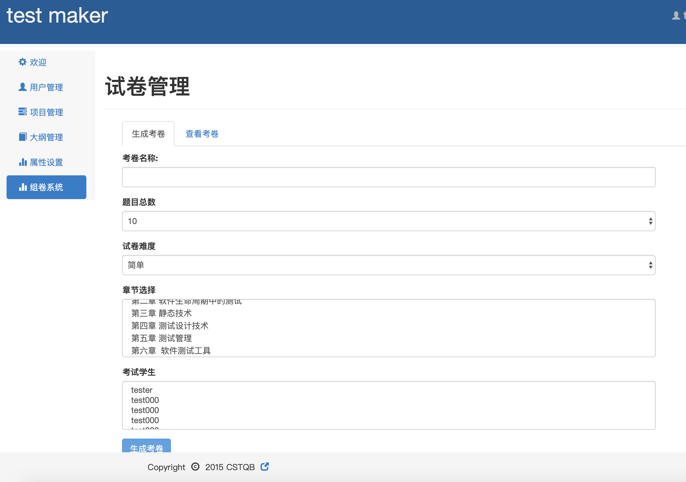
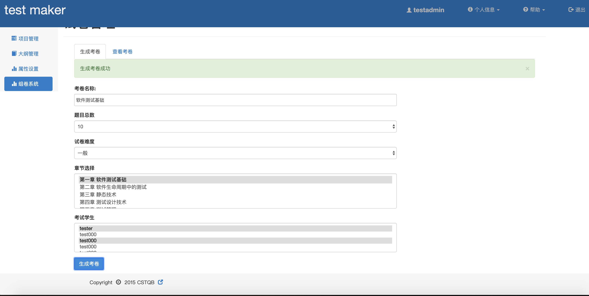
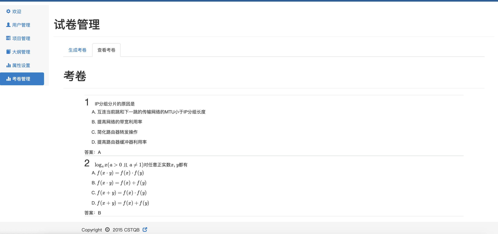
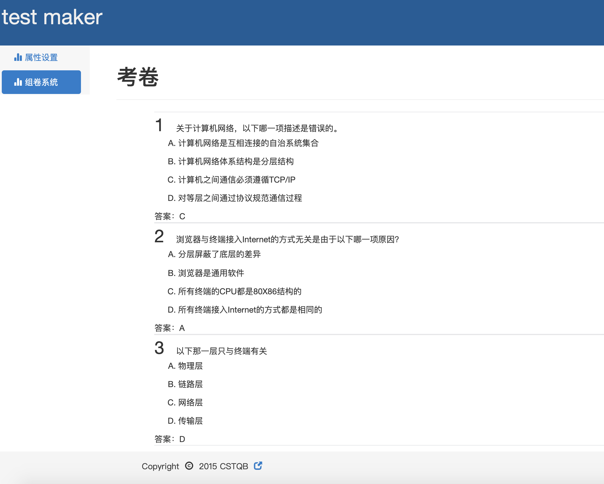
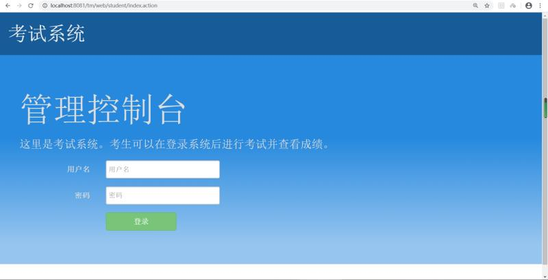
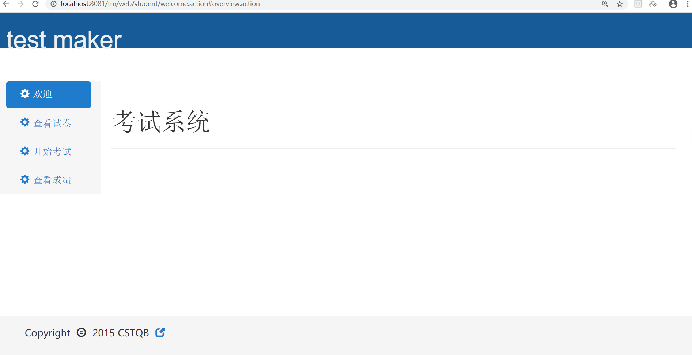
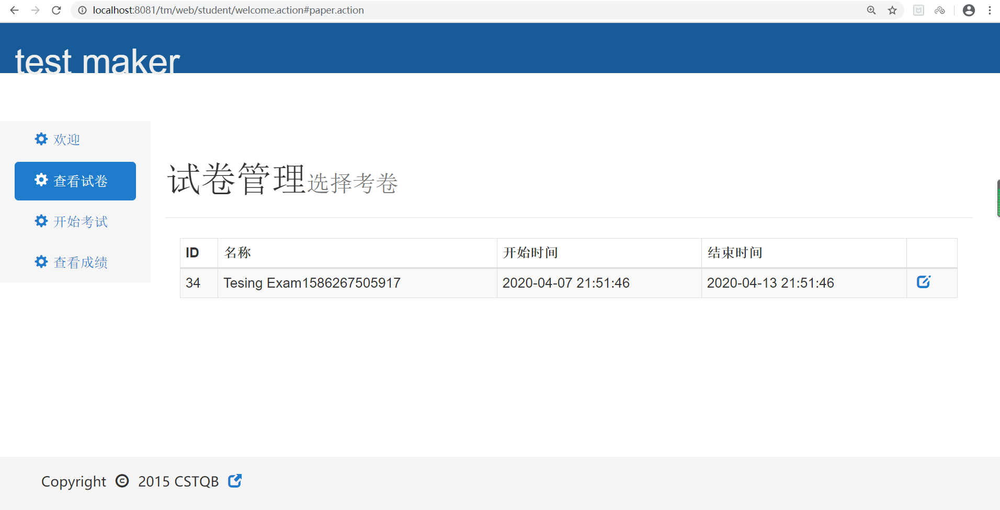
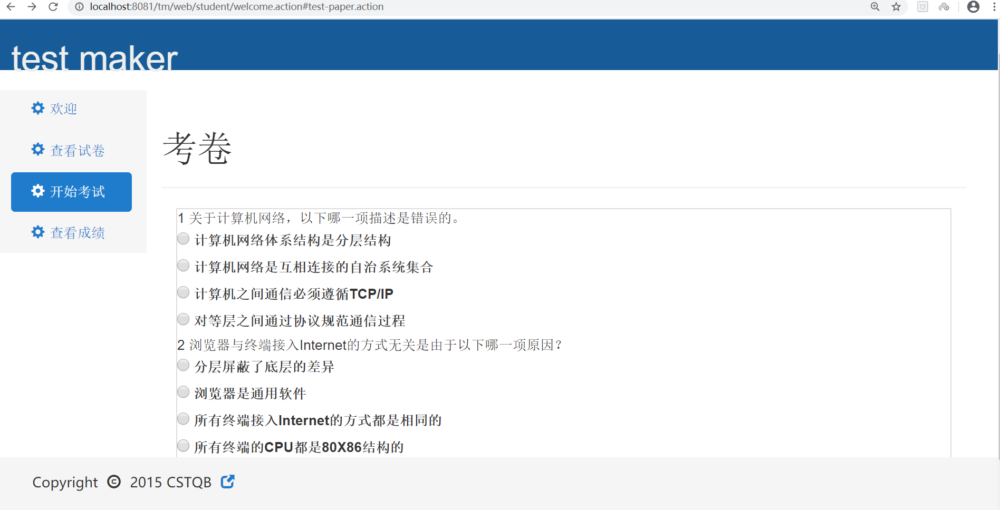
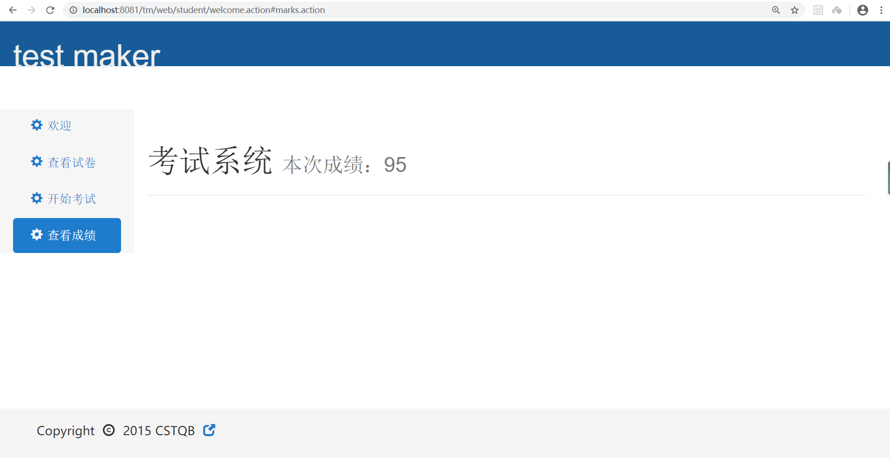

```{r eval=FALSE, include=FALSE}
tinytex::install_tinytex()
```

\newpage

\LARGE

\begin{center}
\textbf{出题系统功能开发与重构功能实现报告}
\end{center}

\large
\begin{center}
\textbf{\emph{出题系统功能开发与重构功能实现报告}}
\end{center}

# 摘要 {-}

本次作业为软件质量保障与测试课程的Lab2课程作业，需要我们以小组为单位对出题系统进行新功能开发以及既有结构重构。

我小组通过小组会议进行需求分析与确定，通过GitHub平台以私有仓库的形式进行协同工作，利用GitHub平台上的Security Alerts工具进行代码安全漏洞检查与依赖安全性检验，利用Javadoc来清晰地记录对代码的修改过程与完成对所修改的代码的记录和说明过程。

本报告分为四小节。第一节，新增需求描述，对本小组所完成的新增功能以及改进的需求进行了描述和说明；第二节，对原有需求重构后改造的类与方法列表，对本小组作业中所有对原有的方法进行更改的部分进行了记录和说明；第三节，新增类与方法列表，对本小组作业中所有新增类和方法的部分进行了记录和说明；第四节，新/改造功能的运行界面截图及说明，对本小组本次作业中完成的新增功能进行了截屏记录和说明。

除了本文档的记录之外，本小组还将所有改动部分的代码进行了完整的javadoc记录和编译，javadoc编写规范符合了Oracle Java EE Javadoc编写规范，作为本次文档提交内容的一部分，javadoc的编译结果也将会被提交，从而方便他人通过具有搜索等功能的交互式网页对本小组进行完成的开发工作的代码部分工作进行了解。

# 关键词 {-}

新功能开发; 系统重构; 实现报告

\normalsize

\newpage

\tableofcontents

\newpage

# 新增需求描述

## 新增模块

| 新增模块需求指的是相对于原有的出题系统的“出题”这一功能模块，新增的较为具有系统性的、能够独立完成一定功能任务的子系统。

以下为我小组在开发的过程中新开发的具有独立性和完整性的模块。

### 组卷系统模块

该模块允许具有组卷权限的用户，根据个性化需求填写相应的限制条件，由系统自动生成对应考卷，用户可对生成考卷进行预览。

#### 自动组卷

- 关键词：选择&nbsp;限制条件
- 用户可以对试卷进行一系列条件的设置，设定考卷的名称、题目数量、难易程度、涉及章节和知识点以及允许作答的用户，系统会自动生成符合条件的考卷。
- 验收标准：用户可以成功输入限制条件、创建考卷。

#### 试卷预览

- 关键词：预览&nbsp;数学公式
- 用户可以在试卷查看界面看到自己生成的所有试卷，并点击试卷进行试卷内容预览。
- 在包含以$LaTeX$格式输入数学公式的试卷中，预览界面需正确解析$LaTeX$公式，显示标准格式的数学公式。
- 验收标准：用户可以正确查看带数学公式的试卷。

### 考试系统模块

该模块允许已注册的考生，登录系统查看自己的考卷，进行考试并查看成绩。

#### 考生登录

- 关键词：登录
- 考生可以通过学号密码登录，进入考试系统。
- 验收标准：用户可以成功登录系统。

#### 试卷查看

- 关键词：查看
- 用户可以在查看界面看到自己可以进行考试的所有试卷，并点击试卷进行考试。
- 验收标准：用户可以正确查看所有属于自己的考卷。

#### 进入考试

- 关键词：考试
- 用户可以查看题目，并且可以选择答案并提交。
- 验收标准：用户开始考试，选择答案并提交。

#### 查看成绩

- 关键词：查看成绩
- 提交后用户可以查看自己的成绩。
- 验收标准：用户能正确查看自己的考试的成绩。

## 新增非模块功能


\pagebreak

# 对原有需求重构后改造的类与方法列表

\pagebreak

# 新增类与方法列表

\pagebreak

# 新/改造功能的运行界面截图及说明

我小组对各类新开发的功能及改造原有的功能进行了详细的功能介绍与截图说明。

## 新增功能运行界面截图及说明

### 试卷系统模块

#### 限制条件界面

在【组卷系统】下选择【生成考卷】，进入考卷限制条件页面，用户可以输入试卷名称，选择考卷题目数量（系统预先设定选择范围在10，15，20，25，30之间），设置试卷难易程度（简单、一般、困难）、选择试卷相关的章节以及设置有权参与考试的学生。



#### 生成考卷

用户在完成限制条件的设置后，点击按钮【生成考卷】，页面显示试卷生成成功或失败的提示信息。若试卷生成成功，则可在【查看考卷】栏目下，点击查看对应考卷



#### 数学公式显示

在题目显示时，如果题库中包含以$LaTeX$格式输入的数学公式，界面会将其转化为标准数学公式形式进行显示



#### 查看所有试卷

在【组卷系统】下选择【查看考卷】，首先进入所有考卷界面，用户可以选择相应的试卷进行预览


#### 试卷预览

选择对应标题的试卷，进入试卷预览界面：



### 考生考试系统

#### 考生登陆页面

考生可以通过输入登录网址进入考生登录页面，通过输入学号密码进入考生考试系统。



#### 总界面

考生进入系统后看到的界面。



#### 试卷查看界面

考生可以点击侧边菜单栏中的【查看考卷】，看到可以考试的所有试卷。



#### 考试界面

考生可以在查看考卷页面点击试卷，然后进入开始考试。



#### 分数查看界面

考生可以点击侧边菜单栏中的【查看分数】，看到可以上一场考试的成绩。


 v 

## 改造功能运行界面截图及说明


\pagebreak

# 参考文献 {-}
