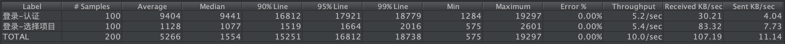
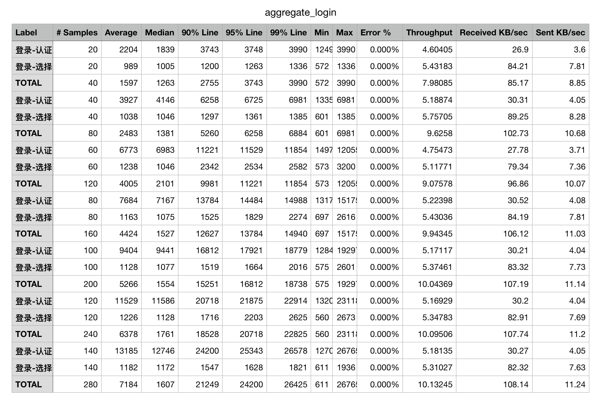
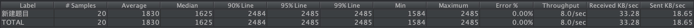
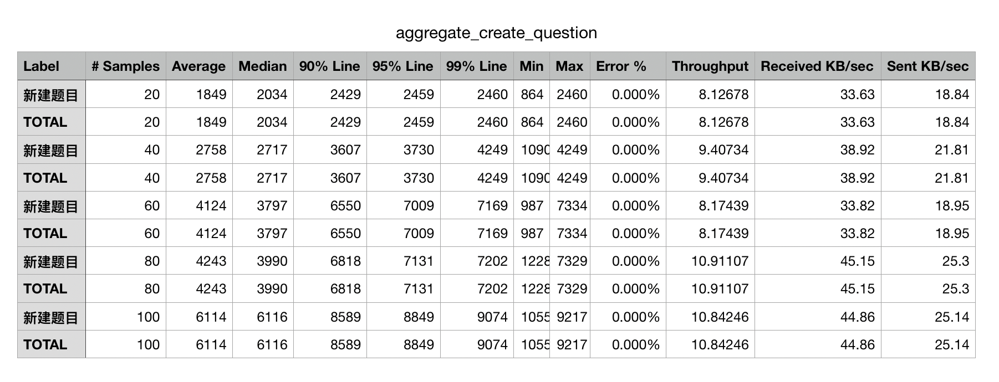

```{r eval=FALSE, include=FALSE}
tinytex::install_tinytex()
```

\newpage

\LARGE

\begin{center}
\textbf{黑盒测试设计与执行}
\end{center}

\large
\begin{center}
\textbf{\emph{软件质量保障与测试课程Lab6课程作业}}
\end{center}

# 摘要 {-}

本次作业为软件质量保障与测试课程的Lab5课程作业，需要我们以小组为单位完成对出题系统的黑盒测试。本文档分为三小节。第一小节介绍了本小组设计的黑盒测试整体框架以及测试流程；第二小节介绍了黑盒测试中的关键字以及测试数据设计；第三小节介绍了本小组对黑盒测试任务的具体脚本实现以及运行情况介绍。

# 关键词 {-}

系统与软件工程; 系统与软件质量要求和评价; 测试文档

\normalsize

\newpage

\tableofcontents

\newpage

# 测试框架设计


# 性能测试指标


# 测试脚本实现及运行结果

## 登录

1. 100 个用户同时在线


2. 20 ～ 140 个用户同时在线，每次递增20个用户，对系统性能进行并发测试


## 创建考题

1. 20道考题的并发创建


2. 20 ~ 100 道考题并发创建，每次递增20道考题创建量，对系统性能进行并发测试



\pagebreak

# 参考文献 {-}
