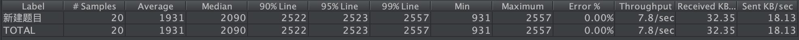

```{r eval=FALSE, include=FALSE}
tinytex::install_tinytex()
```

\newpage

\LARGE

\begin{center}
\textbf{黑盒测试设计与执行}
\end{center}

\large
\begin{center}
\textbf{\emph{软件质量保障与测试课程Lab6课程作业}}
\end{center}

# 摘要 {-}

本次作业为软件质量保障与测试课程的Lab6课程作业，需要我们以小组为单位完成对出题系统的性能测试。本文档分为两小节。第一小节介绍了本小组进行性能测试采用的策略；第二小节介绍了性能测试的结果及系统性能分析。

# 关键词 {-}

系统与软件工程; 系统与软件质量要求和评价; 测试文档

\normalsize

\newpage

\tableofcontents

\newpage

# 测试策略
采用的是并发测试和负载测试的策略。性能指标为系统同时在线100人，20个并发访问。
我们使用Jmeter工具来进行性能测试。
并发测试中，对应在线100人的要求，发出100个登录请求，对应20个并发访问的要求，发出20个创建考题的请求，使用定时器让请求同时发送，以观察并发状况下服务的行为表现。
负载测试中，进行了从20到140个用户同时在线的测试，和同时创建20到100个考题的测试，每次增量为20。通过这一策略来寻找系统的性能上限。


# 系统性能及测试结果分析

## 登录

1. 100 个用户同时在线

从结果中可以看出，在并发数为100的情况下，认证步骤的平均响应时间为9.4秒，选择项目的平均响应时间为1.1秒，整个登录步骤的平均响应时间约为10.5秒。根据用户满意度曲线来看，在并发数100的情况下，系统的响应时间有些过长，性能指标没有很好的达到。

2. 20 ～ 140 个用户同时在线，每次递增20个用户，对系统性能进行并发测试

从表中可以看出，登录的选择部分的响应时间随着并发数的增加变化不大，说明这一服务有较大的可扩展性。而认证部分随着并发数增加，响应时间明显变长。所以对于登录功能来说，认证部分是性能的瓶颈所在，调优时应重点关注。

并发数达到80后，吞吐量不再有太大的增长，说明系统处理能力已经接近饱和。

<<<<<<< HEAD
登录部分的性能测试未能达到指标，可能是由于在本地服务器上进行的测试。但在并发数超过指标20%以上的情况下，虽然响应时间变长，但系统仍然能保持功能完整性，没有失效，说明系统在压力下仍能正常运行，稳定性较好。
=======
## 登录

1. 100 个用户同时在线


2. 20 ～ 140 个用户同时在线，每次递增20个用户，对系统性能进行并发测试


>>>>>>> c4ddcf8fec1f4cb8297ab71fcd9322f2f0cff205

## 创建考题

1. 20道考题的并发创建
<<<<<<< HEAD

从结果中可以看出，在并发数为20的情况下， 响应时间平均为1.9秒，最大不超过2.5秒。所以创建考题部分较好地达到了性能指标。

2. 20 ~ 100 道考题并发创建，每次递增20道考题创建量，对系统性能进行并发测试

从表中可以看出，随着并发数的上升，响应时间有明显的增加。但在超过指标100%以上的情况下，服务仍然能够正常运行，且以用户满意度曲线为参考，响应时间较为合理，所以这一服务拥有很高的可扩展性。
吞吐量同样在并发数达到80后趋于稳定，说明系统处理能力趋于饱和。
=======


2. 20 ~ 100 道考题并发创建，每次递增20道考题创建量，对系统性能进行并发测试


>>>>>>> c4ddcf8fec1f4cb8297ab71fcd9322f2f0cff205

\pagebreak

# 参考文献 {-}
