\newpage

\LARGE

\begin{center}
\textbf{性能测试设计与执行}
\end{center}

\large
\begin{center}
\textbf{\emph{软件质量保障与测试课程Lab7课程作业}}
\end{center}

# 摘要 {-}

本次作业为软件质量保障与测试课程的Lab7课程作业，需要我们以小组为单位完成对出题系统的静态检查。本文档分为五小节。第一小节介绍了本小组进行Sonar检查的结果情况；第二小节介绍了本小组利用p3c工具进行检查的检查结果情况；第三小节介绍了本小组利用Jslint工具进行静态检查的检查结果情况；第四小节介绍了本小组对上述不同检查工具之间的异同点、优缺点分析的情况；第五小节介绍了本小组对本次静态检查的测试总结。

# 关键词 {-}

系统与软件工程; 系统与软件质量要求和评价; 测试文档

\normalsize

\newpage

\tableofcontents

\newpage

# Sonar工具静态测试

## 测试结果完整报告

“出题系统”前端(Javascript)检测报告见附件2020-05-24-test-maker-fore-report

“出题系统”后端(Java)检测报告见附件2020-05-24-my_project-report

## 测试结果核心内容截图

sonar检测报告网页版视图中，分别以总览、问题、安全热点、指标、代码来记录对代码的分析结果，下面将分别截图这些部分。

sonar检测报告的文档版的内容与网页版一致，具体报告在附件中可以查看。

### 前端检测报告

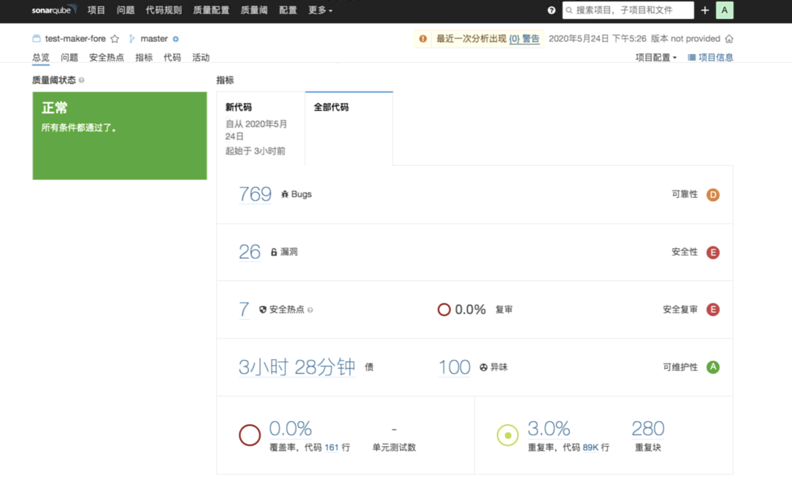

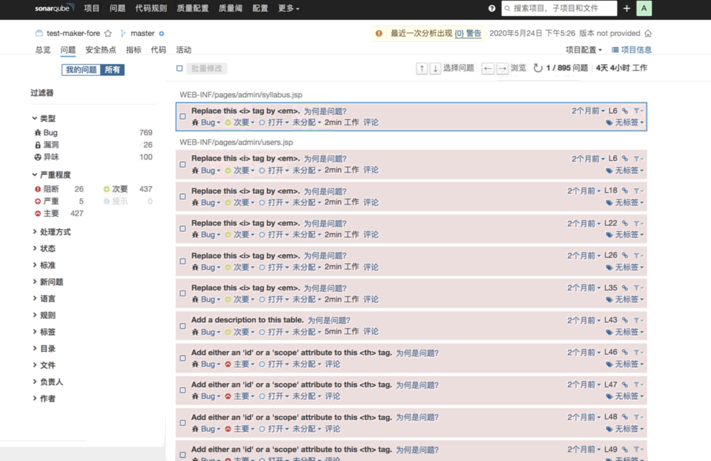

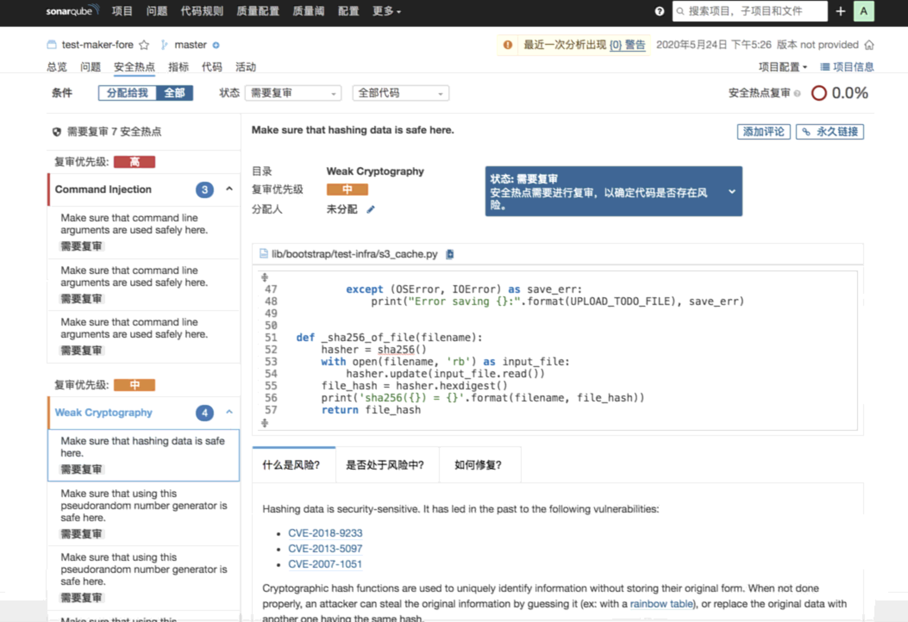

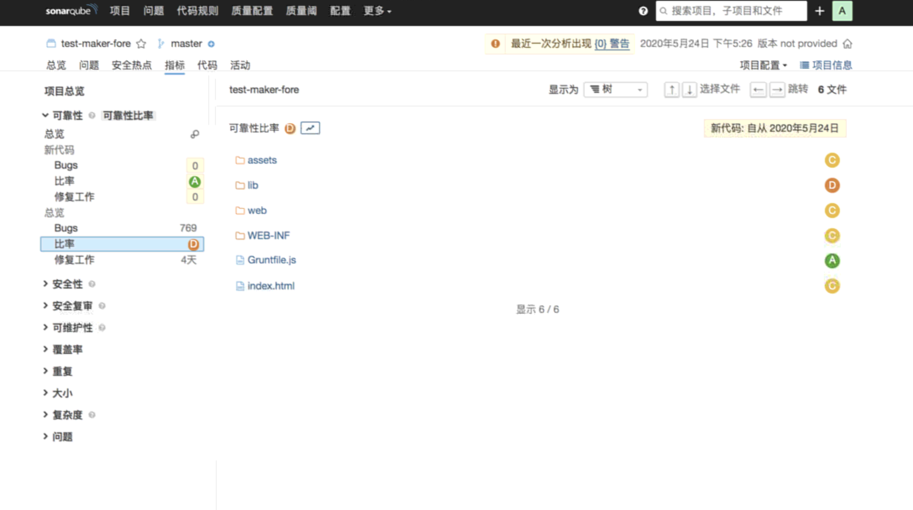

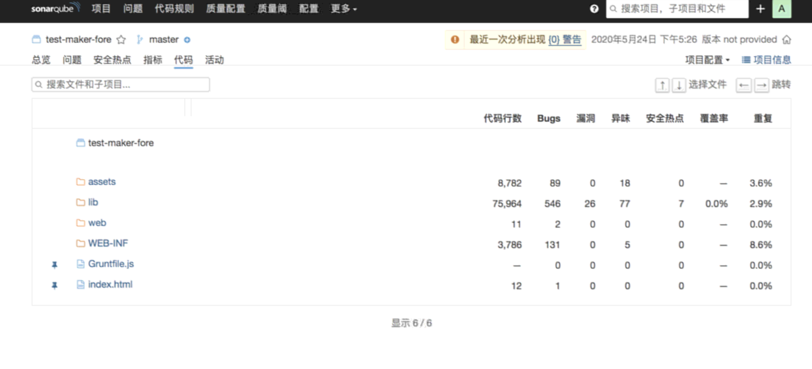

### 后端检测报告

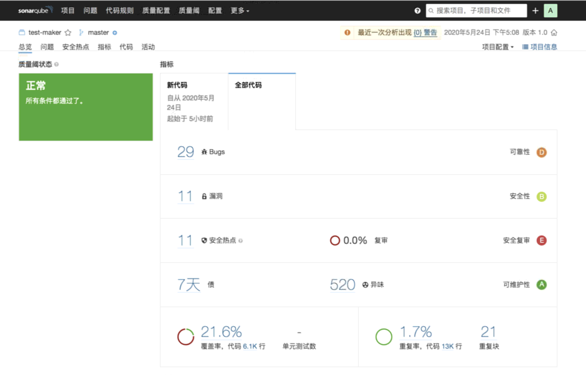

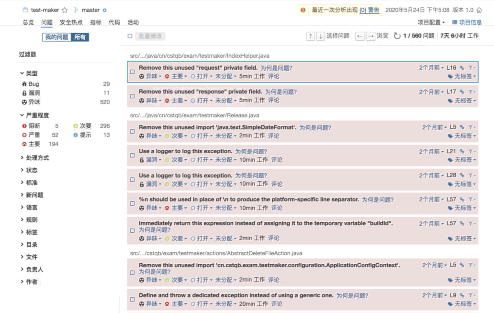

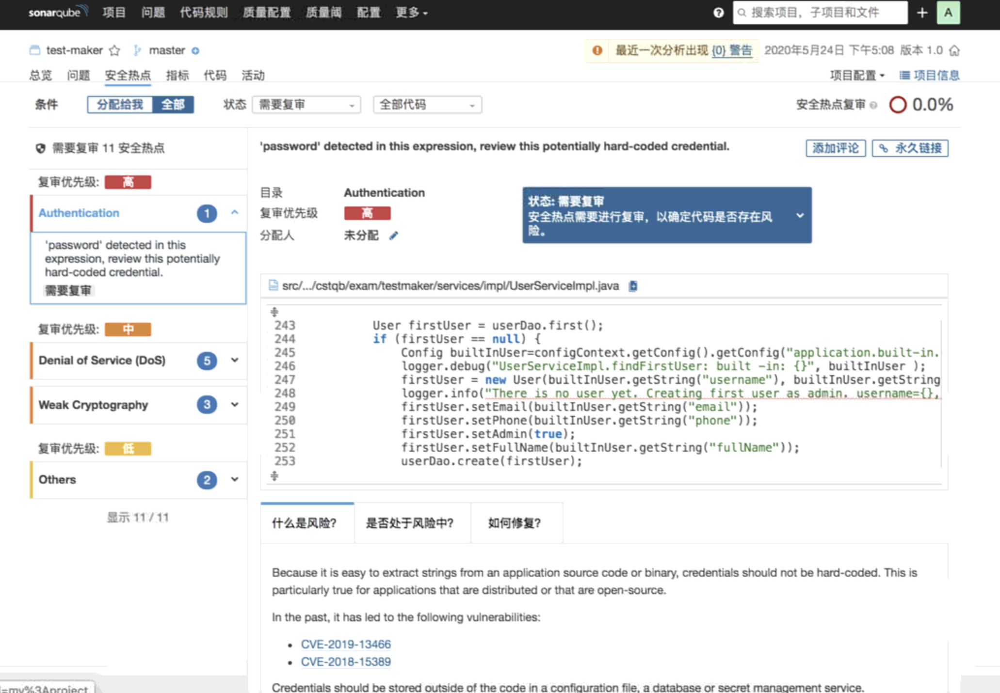

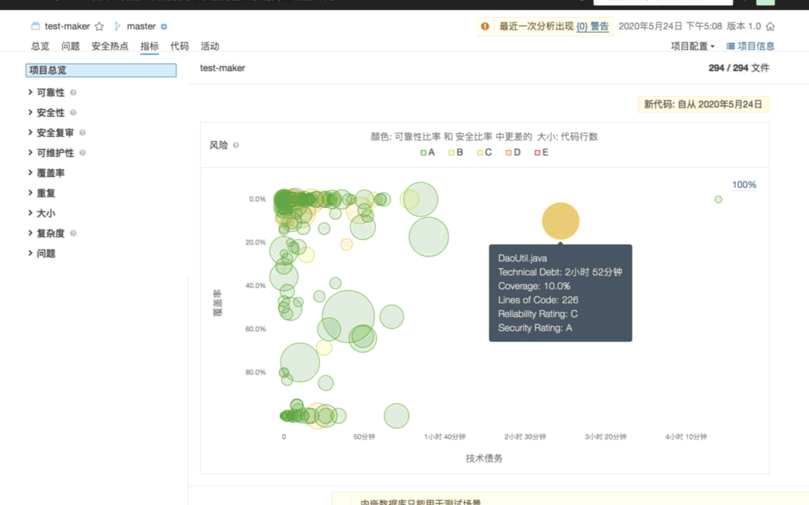

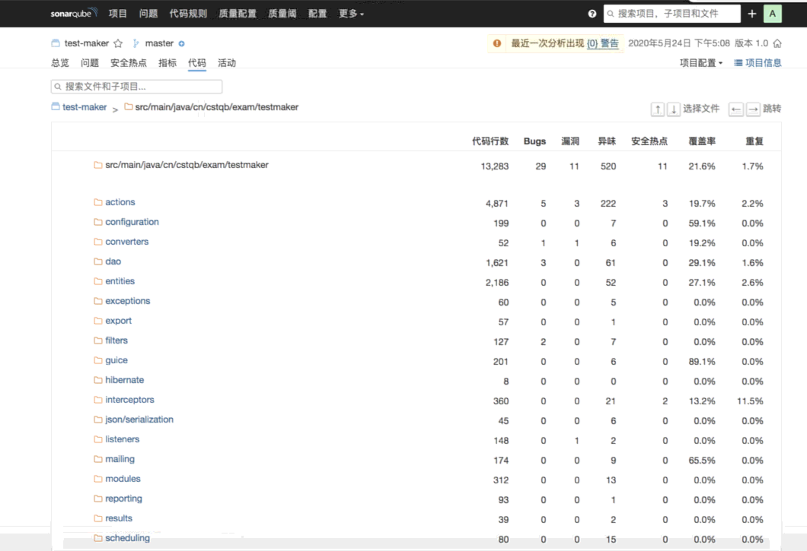

## 测试结果分析

Sonar是一个用于代码质量管理的开源平台，用于管理源代码的质量。

### sonar测试报告特点

sonar的code viewer（代码）部分向开发者展示代码源文件和高层次的数据，包含了行数、问题数、单元覆盖率、重复度、代码近期提交信息等。其中，coverage用三种色彩可视化标记，红色表示没有覆盖，橙色表示部分覆盖，绿色表示完全覆盖。duplications计算重复代码的行数并定位。

sonar的issues（问题）部分分析的粒度为类型、严重程度、处理方式、状态、标准、新问题、语言、规则、标签、目录、文件、负责人、作者。严重程度划分为blocker，critical，major，minor，info，对应致命（阻断），关键（严重），主要，微小（次要），未知（提示）。在issues中，sonar还会列出maintainability，documentation，complexity，bulk change，dispositioning等项。

### 扫描效果

选择的是sonar默认的扫描规则，效果非常细致，相对来说扫描过程用时也比较久。sonar将问题分为bud，code_smell和vulnerability，严重程度划分为minor,major,blocked,critical,info。bug类型的问题多涉及到比如比较判断符错误使用，空指针重定向，条件分支不可达等，code_smell类型涉及到方法返回值不能一直不变，方法体不能为空等，vulnerability类型涉及引用了已知有漏洞的函数的代码。

sonar扫描的问题比较全面，也可以做到持续的代码检查跟进，具有高可用性和较短的反馈循环。提供了多种语言检测支持。

# p3c工具静态测试

## 测试结果完整报告

请通过网址[第9组P3C报告网站](https://straybird-atsh.github.io/SoftwareQA-Testing/P3CReport.html)来查看本小组的P3C完整报告。

## 测试结果核心内容截图

如图11和12所示，可分为Blocker、Critical、Major三部分。

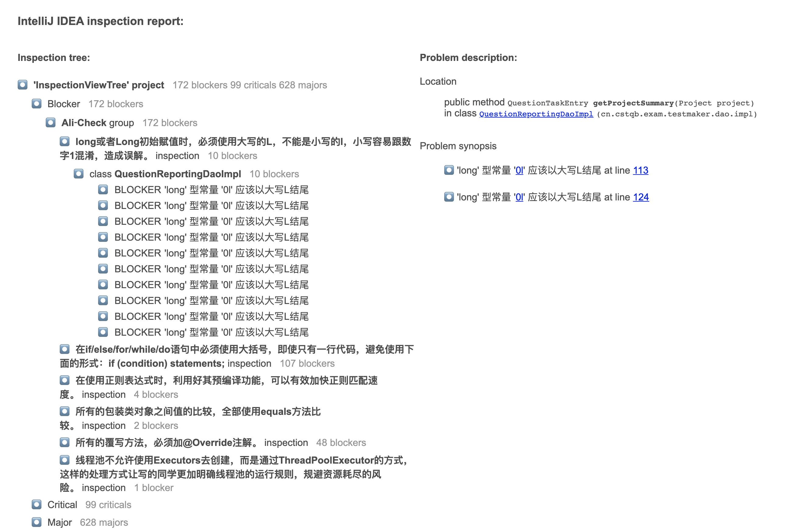

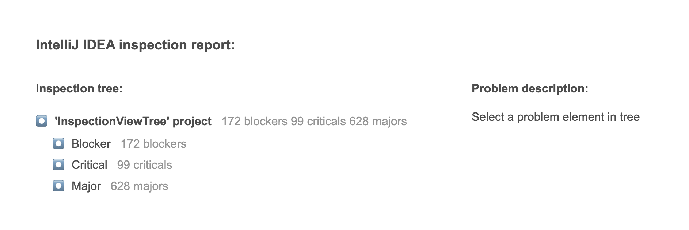

## 测试结果分析

P3C是阿里巴巴推出的《阿里巴巴 Java 开发规约》扫描插件，目前在 IDEA 和 Eclipse 都有较好的支持。P3C扫描结果文档给出了项目的 bug，并根据 bug 的严重程度分为三个级别展示。三个级别分别是：Blocker, Critical, Major，严重程度由高到低。

### 阿里巴巴 JAVA 开发手册

根据《阿里巴巴 JAVA 开发手册》版本1.3.0，我们可以对扫描结果进行分析。该版本对 JAVA 开发的规约含有编程规约、异常日志、单元测试、安全规约等六大类，而本项目的扫描结果重点体现的是编程规约。编程规约在开发手册共分为9类：

- 命名规范
- 常量定义
- 代码格式
- OOP 规约
- 集合处理
- 并发处理
- 控制语句
- 注释规约
- 其他

### 扫描效果

根据扫描结果可以发现：同一类型的编程规约由于其严重性不同可以划分为不同级别的 bug。比如注释规约中，抽象方法的 javadoc 注释属于 Major，而枚举字段的注释属于 Critical; 命名规范中也有类似的例子。另外，bug 的严重程度分类比较合理。注释规约、命名规范的约定内容严重程度较低，并发处理、控制语句的约定内容严重程度较高。**整体上，P3C扫描插件发现的问题比较基础，它侧重 JAVA 编程细节可能导致的系统失效。**

### 插件使用

P3C插件有以下的优点：

- 基本满足代码规范检测的需求。
- 能够检测出细致和易忽略的问题，可以提高开发过程中对代码细枝末节的注意。
- Quick fix，检测出问题后可以快速查看 bug 位置、解决方案并一键替换。
- 中文提示，解释内容与开发手册一致。

此外P3C插件也存在平台限制、功能不成熟、扫描能力有限等问题。

# jshint工具静态测试

## 测试结果完整报告

请通过网址[第9组JSHint报告网站](https://straybird-atsh.github.io/SoftwareQA-Testing/JSHintReport.html)来查看本小组的JSHint完整报告。

## 测试结果核心内容截图

如图13和14所示所示，共发现236个failures，1个error和235个warnings。其中每一项都标明了具体的行数、问题代码和问题原因。

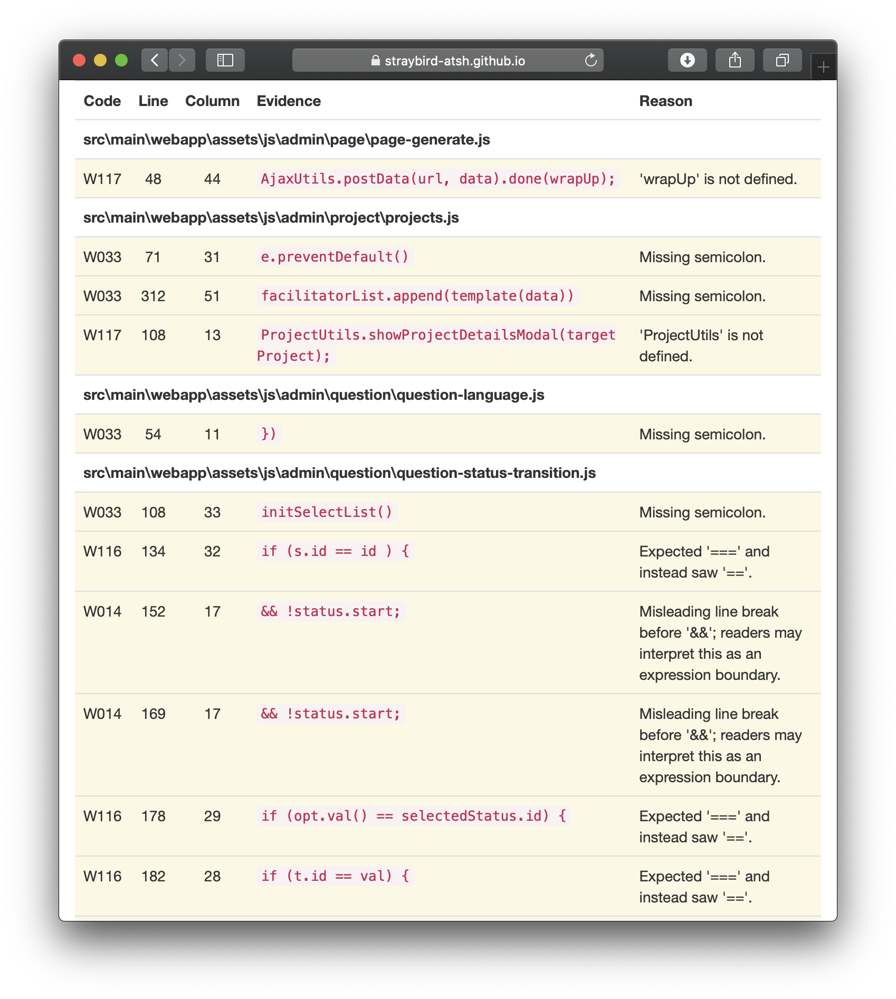

## 测试结果分析

JSHint 是由Anton Kovalyov基于 JSLint 的代码实现的开源项目，JSHint 与 JSLint  相比较之下，更友好，也更容易配置，所以发展很快并得到了众多IDE和编辑器的支持。

JSHint 是一个 JavaScript 语法和风格的检查工具，但检查不出逻辑问题。它可以根据配置参数扫描 JavaScript代码，分析其中的语法与风格从而给出代码质量报告。

### 配置项

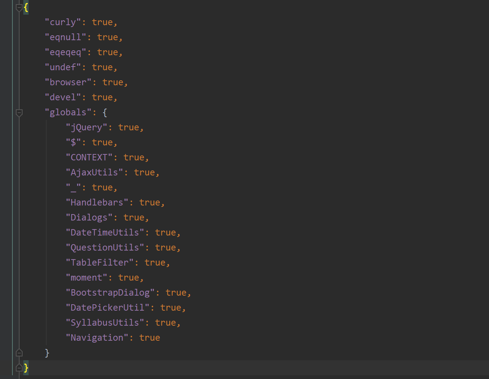

JSHint 工具使用的关键是配置项。如果不设置配置项，那么可能会有很多“假”错误或警告。比如自定义全局变量，不同脚本上下文的符号引用。这些内容既不算错误的语法，也不算差劲的风格，可是 JSHint 依旧把他们认错了。JSHint 有一些常见的配置项：

- "strict": true 严格模式 
- "asi": true 允许省略分号
- "bitwise": true 禁止使用位运算符，比如经常把&&写错& 规避此错误
- "eqeqeq": true 禁止使用== 和 ！=  强制使用=== 和 ！==
- "undef": true 禁止使用不在全局变量列表中的未定义变量
- "curly": true 循环或者条件语句必须使用花括号包住
- "devel": true 定义用于调试的全局变量：console,alert 
- "jquery": true 定义全局暴露的jQuery库 （可以去掉）
- "browser": true 暴露浏览器属性的全局变量 如window document
- "globals": {"$":true,"require":true,"_":true}

JSHint 的配置项一般是放入项目根目录下的 .jshintrc 文件中，JSHint 工具在扫描的时候就会运用这些配置项。配置项的作用一方面是明确项目的编程规范，约束开发人员的行为。另一方面是避免某些规范，减轻开发人员的负担（比如允许省略分号等）。

### 扫描效果

不同的配置项扫描结果是不尽相同的。项目最初未定义配置项中的全局变量，这导致了非常多的未定义错误或警告。这显然不是我们需要的扫描结果。完成配置项后，扫描结果报告逐渐明晰，其中报告了出现了缺少分号、使用==和!=错误、缺少{或}错误和未定义变量等错误。正如上面所言，JSHint 可以分析出 JavaScript 代码的语法和风格，但是它无法识别出项目的逻辑错误，比如冗余代码、死循环、无效代码等问题。它的分析功能是非常基础和有限的。

### 工具使用

JSHint 工具不可否认具有一定的优点：

- 有了很多参数可以配置
- 支持配置文件，方便使用
- 支持了一些常用类库（如jquery等）
- 支持了基本的ES6

但与其他功能强大的 Web 项目静态扫描工具比较而言，它具有不支持自定义规则、无法根据错误定位到对应的规则和不提供快捷的修正方式等缺点。不支持自定义规则自然让它只能检测出很基础的预定义规则，无法根据错误定位到对应的规则使得扫描结果不易阅览，不提供快捷的修正方式（不能跳转到指定代码位置和不能提供修正方案）自然无法让开发人员方便的处理扫描结果。

# 不同工具之间的对比分析

- sonar：定位是代码质量平台，本身不进行代码分析，但可以集成各个静态分析工具以及其他软件开发测试工具，并基于集成工具的结果数据按照一定的质量模型，对软件的质量进行评估。甚至可以选择接入p3c规范进行代码扫描。sonar基于扫描规则进行扫描，因此扫描的问题可以比较全面，本身是代码质量平台，可以做到持续的代码检查跟进，具有高可用性和较短的反馈循环。提供了多种语言检测支持。生成的检测报告也比较详细，数据可视化好。是几个工具中专业性最高的。

- p3c是一套自动化的IDE检测插件（主要是IDEA、Eclipse）该插件在扫描代码后，将不符合《手册》的代码按Blocker/Critical/Major三个等级显示在下方，根据错误定位到对应的规则,在IDE中提供快捷修正方式，但p3c扫描检测的问题较为基础，侧重JAVA编程细节可能导致的系统失效，之后仍需要类似FindBugs的插件再次扫描检测bug。

- JSHint 是由Anton Kovalyov 基于JSLint 的代码实现的开源项目，是一个JavaScript 语法和风格检查的命令行工具，不能检查出逻辑问题。它可以根据配置参数扫描JavaScript代码， 分析其中的语法风格从而给出代码质量报告。相比于sonar它不支持自定义规则、相比于p3c它无法根据错误定位到对应的规则，也不提供快捷的修正方式，分析功能也非常基础和有限，是并不算强大的web静态扫描工具。

# 测试总结

在我们选取的三个测试工具中，sonar定位于代码质量平台，集成各种静态分析工具和其它测试工具，提供持续代码检测跟进，是最强大和专业的静态测试工具。而p3c和JSHint分别是针对Java和JS开发的基于编码及设计实践的静态检测工具，p3c做成了IDE检测插件，JSHint则是命令行工具，由于二者都偏重于代码编写格式，及是否符合编码规范的检验，内置编程规范比较基础，对代码 bug发现功能较弱。
此次整体感受是静态代码分析工具能够在代码构建过程中帮助开发人员快速、有效的定位代码缺陷并及时纠正代码缺陷，从而极大地提高软件可靠性并节省软件开发和测试成本。

\pagebreak

# 参考文献 {-}
