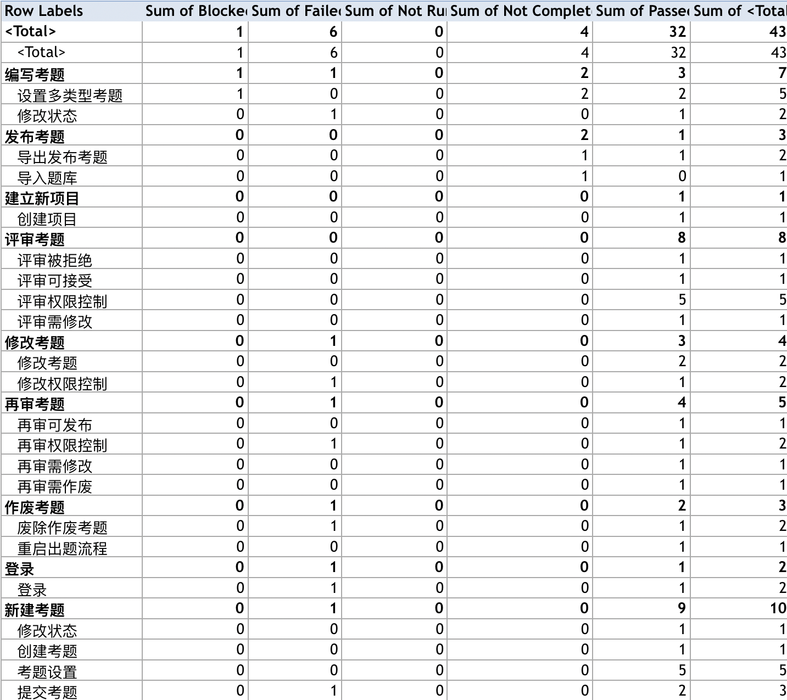
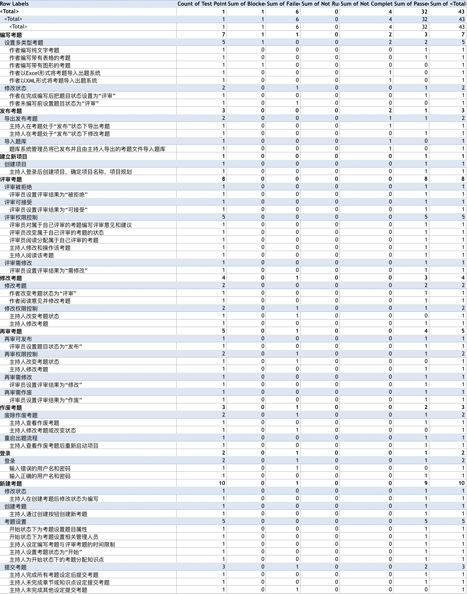
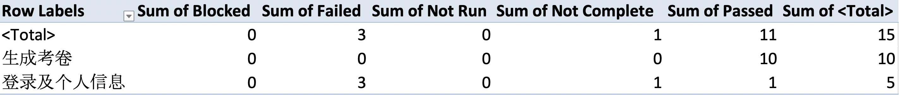
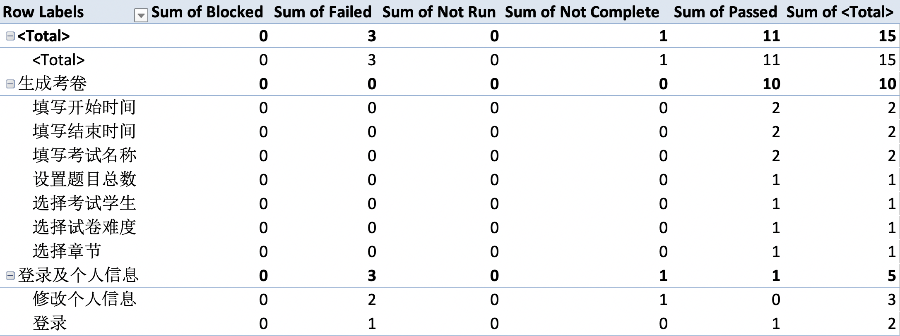
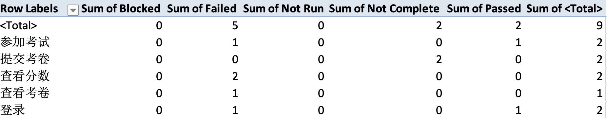
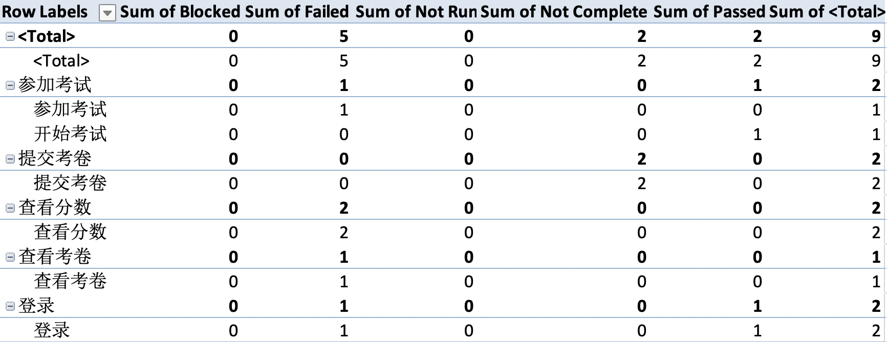
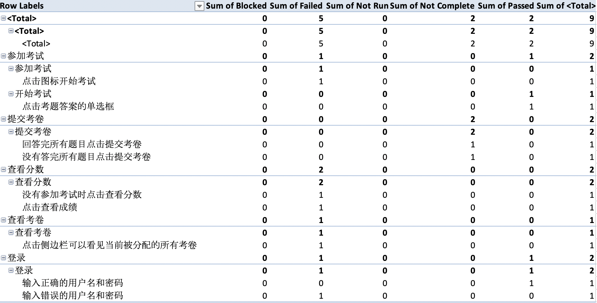

```{r eval=FALSE, include=FALSE}
tinytex::install_tinytex()
```

\newpage

\LARGE

\begin{center}
\textbf{场景测试报告}
\end{center}

\large
\begin{center}
\textbf{\emph{软件质量保障与测试课程Lab8课程作业}}
\end{center}

# 摘要 {-}

本次作业为软件质量保障与测试课程的Lab8课程作业，需要我们以小组为单位完成对出题系统的场景测试。本文档分为五小节。第一小节介绍了本小组进行测试计划设计的情况；第二小节介绍了本小组设计测试范围的情况；第三小节整理了本小组进行测试的结果；第四小节介绍了本小组对bug等级的评估情况；第五小节介绍了本小组对本次场景测试的测试总结。

# 关键词 {-}

系统与软件工程; 系统与软件质量要求和评价; 测试文档

\normalsize

\newpage

\tableofcontents

\newpage

# 测试计划
## 登录及个人信息
### 登录

* 输入正确的用户名和密码
* 输入错误的用户名和密码 

### 修改个人信息

* 登录状态下对用户名进行修改
* 登录状态下对密码进行修改
* 非登录状态下访问修改个人信息页面

## 建立新项目

### 创建项目

* 主持人登录后创建项目，确定项目名称，项目规划

## 新建考题

### 创建考题

* 主持人通过创建按钮创建新考题

### 考题设置

* 主持人设置考题状态为“开始”
* 开始状态下为考题设置题目属性
* 开始状态下为考题设置相关管理人员
* 主持人为开始状态下的考题分配知识点
* 主持人设定编写考题与评审考题的时间限制

### 提交考题

* 主持人完成所有考题设定后提交考题
* 主持人未完成章节或知识点设定提交考题
* 主持人未完成其他设定提交考题

### 修改状态

* 主持人在创建考题后修改状态为编写

## 编写考题

### 设置多类型考题

* 作者编写纯文字考题
* 作者编写带有表格的考题
* 作者编写带有图形的考题
* 作者以Excel形式将考题导入出题系统
* 作者以XML形式将考题导入出题系统

### 修改状态

* 作者在编写过程中设置题目状态为“评审”
* 作者在完成编写后把题目状态设置为“评审”

## 评审考题

### 评审可接受

* 评审员设置评审结果为“可接受”

### 评审被拒绝

* 评审员设置评审结果为“被拒绝”

### 评审需修改

* 评审员设置评审结果为“需修改”

### 评审权限控制

* 评审员阅读分配属于自己评审的考题
* 评审员对属于自己评审的考题编写评审意见和建议
* 评审员改变属于自己评审的考题的状态
* 主持人阅读该考题
* 主持人修改和操作该考题

## 再审考题

### 再审可发布

* 评审员设置题目状态为“发布”

### 再审需修改

* 评审员设置评审结果为“修改”

### 再审需作废

* 评审员设置评审结果为“作废”

### 再审权限控制

* 主持人修改考题
* 主持人改变考题状态

## 修改考题

### 修改考题

* 作者阅读意见并修改考题
* 作者改变考题状态为“评审”

### 修改权限控制

* 主持人修改考题
* 主持人改变考题状态

## 发布考题

### 导出发布考题

* 主持人在考题处于“发布”状态下导出考题
* 主持人在考题处于“发布”状态下修改考题

### 导入题库

* 题库系统管理员将已发布并且由主持人导出的考题文件导入题库

## 作废考题

### 废除作废考题

* 主持人查看作废考题
* 主持人修改考题或改变状态

### 重启出题流程

* 主持人查看作废考题后重新启动项目

## 生成考卷

### 填写考试名称
* 输入合法的考试名称
* 输入非法的考试名称

### 设置题目总数
* 输入范围为1~5的数字

### 选择试卷难度
* 选择简单
* 选择一般
* 选择困难

### 填写开始时间
* 填写格式正确的时间
* 填写格式错误的时间

### 填写结束时间
* 填写格式正确的时间
* 填写格式错误的时间

### 选择章节
* 选择具体的章节

### 选择考试学生
* 选择本次考试的学生

## 考试

### 查看考卷
* 点击侧边栏查看考卷

### 参加考试
* 点击图标开始开始
* 点击考题答案的单选框进行选择

### 提交考卷
* 回答完所有题目提交考卷
* 没有答完所有题目提交考卷

### 查看分数
* 点击查看成绩
* 没有参加考试时点击查看成绩


# 测试范围制定

## 出题场景

### 登录
* 登录

### 建立新项目
* 创建项目


### 新建考题
* 新建考题

### 编写考题
* 设置多类型考题
* 修改状态

### 评审考题
* 评审可接受
* 评审被拒绝
* 评审需修改
* 评审权限控制

### 再审考题
* 再审可接受
* 再审被拒绝
* 再审需修改
* 再审权限控制

### 发布考题
* 导出发布考题
* 导入题库

### 作废考题
* 废除作废考题
* 重启出题流程

## 创建试卷与考试场景

### 登录及个人信息
* 登录
* 修改个人信息

### 生成考卷
* 填写考试名称
* 设置题目总数
* 选择试卷难度
* 填写开始时间
* 填写结束时间
* 选择章节
* 选择考试学生

## 参加考试场景

### 登录
* 登录

### 查看考卷
* 查看考卷

### 参加考试
* 参加考试
* 开始考试

### 提交考卷
* 提交考卷

### 查看分数
* 查看分数


# 测试结果整理

## 出题场景

1. 测试错误总数整理


2.整体错误情况 



3. 具体错误情况



## 创建试卷与考试场景

1. 测试错误总数整理



2.整体错误情况 



3. 具体错误情况


## 参加考试场景

1. 测试错误总数整理



2. 整体错误情况 



3. 具体错误情况




# bug等级评估

| bug类别 | bug内容         | 等级评估 |
| -------- | ----------------- | -------- |
| 出题场景 | 编写考题-修改状态 |          |
| 出题场景 | 修改考题-修改权限控制 | column 3 |
| 出题场景 | 再审考题-再审权限控制 |          |
| 出题场景 | 作废考题-废除作废考题 | column 3 |
| 出题场景 | 登录-登录 |          |
| 出题场景 | 新建考题-提交考题 | column 3 |
| 创建试卷 | 登录及个人信息-修改个人信息 | column 3 |
| 创建试卷 | 登录及个人信息-登录 |          |
| 参加考试 | 参加考试-参加考试 | column 3 |
| 参加考试 | 查看分数-查看分数 |          |
| 参加考试 | 查看考卷-查看考卷 | column 3 |
| 参加考试 | 登录-登录 | column 3 |

# 总结陈词

## 出题场景

### 测试流程

出题场景涉及多类参与人员以及双系统（管理系统与用户系统），测试的流程会比较复杂。本场景测试中对于出题场景的核心测试是从创建项目开始，到考题被设定为发布或者废弃结束。一个关于成功出题的测试流程如下：

1. 人员登录

2. 主持人创建项目

3. 主持人新建考题

4. 考题作者编写考题

5. 考题评审员评审考题。根据评审结果，可以回到流程4。

6. 考题质管再审考题。根据评审与再审结果，可以回到流程4。

7. 发布考题

出题的结果也可能是作废考题，它的出现是因为流程5、6出现了其他基本流。而系统中也会存在较多备选流，比如登录时输入错误用户名或密码，新建考题不完成考题设定，考题作者不编写考题企图修改状态等。备选流与基本流相对，也叫无效流或错误流，它模拟用户错误的业务操作流程。

### 测试结果分析
  虽然关于编写、评审、再审考题等重要功能的测试基本上没有发现缺陷，关于用户（作者、评审员、质管、主持人）权限测试也没有发现缺陷，但是测试人员发现了一些严重的功能不足。所以根据测试结果，我们可以得出结论：出题模块暂时不能提交给客户验证。主要存在以下情况：

- 出题模块存在严重功能缺陷。在测试导入功能时，测试人员未找到相应交互模块。在测试导出功能时，导出格式不符合要求，题目导出位置无法锁定。

- 出题模块部分功能存在一般错误。比如在创建考题测试中，根据产品规格说明，应该完成所有设定后方能提交，但实际测试过程中发现无需要设定章节和知识点可以成功创建考题。

- 出题模块部分功能存在轻微缺陷。如测试编写带有图片的考题时，页面会存在卡顿现象。部分错误操作的提示含义不明或过于复杂。系统操作后对于其他相关人员的邮件提醒或其他提醒无法锁定。

- 出题模块可能存在未知风险。出题模块的流程是可成环的，本场景测试只选取了部分测试路径，那么对于过长出题流程是否存在资源泄露、系统崩溃等问题需要进一步验证。出题系统中需要用户输入文本，本场景测试中未测试是否可以避免脚本攻击、SQL注入等安全性问题。


## 组卷场景

### 测试流程

组卷部分的使用者为管理员。完成一次成功的组卷必须经过的步骤包括：

1. 管理员登录系统

2. 管理员点击查看考卷，进入组卷页面

3. 输入组卷相关信息

4. 完成组卷

组卷结果也可能是失败，这与步骤3中输入的信息不符合要求有关。对于系统中存在的错误流，本次场景测试选取了登录部分的输入错误的用户名和密码，组卷部分的输入非法的考试名称、格式错误的开始和结束时间进行测试。

### 测试结果分析

在本次测试中，对于组卷所必须的核心步骤的测试以及错误操作的测试基本没有发现缺陷。所以根据测试结果，我们得出的结论是：组卷模块可以提交给客户验证。详细情况如下：

- 组卷模块的核心功能已经实现。对于组卷功能涉及的一系列操作，包括登录系统，进入组卷页面，输入考试名称，选择题目总数、试卷难度，输入开始和结束时间，选择章节以及选择参与这场考试的学生的测试都通过了。

- 组卷模块对错误输入进行了一定的处理。对于输入的非法的考试名称（此处使用的是为空的名称进行测试），系统能够给出提示。但在输入格式错误的时间时，系统给出的提示是http的状态500，对于用户来说可能无法立刻明白出错的原因。

- 组卷模块可能存在未知风险。系统其他可能存在的风险包括其他的非法输入以及安全性方面的风险。对于非法名称，只测试了为空，而没有测试重复的名称和过长的名称。对于章节和学生选择的多选框如果没有进行选择的情况没有进行测试，以及在没有登录的情况下是否能进入这一界面没有测试。

## 考试场景

### 测试流程

考试部分的使用者为考生。成功参加一次考试的流程如下：

1.学生登录系统

2.学生查看自己参加的所有考试

3.学生开始考试并获取试卷

4.学生点击单选框选择答案

5.学生提交考卷

6.学生查看自己的分数

对于系统中存在的错误流，选择了使用错误的用户名和密码登录，在没有答完所有题目的情况下提交试卷，以及在没有参加考试时查看分数三种情况进行测试。

### 测试结果分析

在本次测试中，对于考试部分的核心流程以及错误操作的测试基本没有发现缺陷。因此根据测试结果，我们得出的结论水：考试模块可以提交客户验证。详细情况如下：

- 考试模块的核心功能已经实现。我们对登录系统、查看考试、开始考试、选择答案、提交考卷、查看分数这些考试模块的核心流程分别进行了测试，并且全都通过。

- 考试模块对错误操作进行了一定的处理。对于没有参加的考试，查看到的分数为零分。但在没有答完所有题目的情况下提交试卷，系统会给出错误提示，这与一般的处理方法并不一致。

- 考试模块可能存在未知风险。系统其他可能存在的风险包括与考试时间相关的错误操作以及安全性相关的风险，如在考试未开始或结束后试图开始考试，在考试结束前查看成绩，在没有登录的情况下进行除了登录以外的操作，以及尝试获取自己没有参加的考试的试卷。


\pagebreak

# 参考文献 {-}
