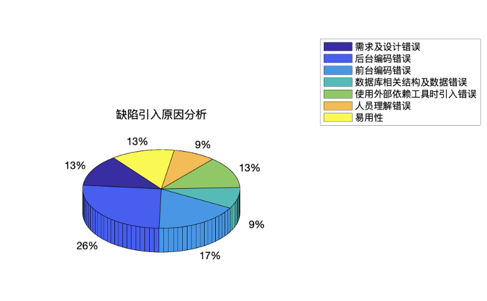

\newpage

\LARGE

\begin{center}
\textbf{场景测试报告}
\end{center}

\large
\begin{center}
\textbf{\emph{软件质量保障与测试课程Lab9课程作业}}
\end{center}

# 摘要 {-}

本次作业为软件质量保障与测试课程的Lab9课程作业，需要我们以小组为单位完成对出题系统的场景测试。本文档分为五小节。第一小节介绍了本小组进行测试计划设计的情况；第二小节介绍了本小组设计测试范围的情况；第三小节整理了本小组进行测试的结果；第四小节介绍了本小组对bug等级的评估情况；第五小节介绍了本小组对本次场景测试的测试总结。

# 关键词 {-}

系统与软件工程; 系统与软件质量要求和评价; 测试文档

\normalsize

\newpage

\tableofcontents

\newpage

# 测试简介

## 目的

编写该测试总结报告主要有以下几个目的

1．	记录测试的主要过程和测试结果

2．	评估测试测试执行和测试计划是否符合，以及测试退出准则是否满足

3．	分析系统存在的缺陷，为修复和预防缺陷提供建议

4．	对本次测试进行总结和评价，并给出改进的建议

## 用户群

1．	项目测试人员

在本项目中，项目测试人员共有以下几位人员：

- 刘佳兴

- 吴琛宁

- 张逸涵

- 张岑媛

- 石睿欣

- 黄佳妮

- 田嘉禾

- 胡宵宵

2．	项目测试经理和管理人员

在本项目中，项目测试经理和管理人员有一名，是本组的组长王宸。

3．	其他项目相关人员

其他项目相关人员包含评审委员会，例如老师和助教，会对每一次测试汇报结果作出评价。

## 测试对象

### 目标系统
#### 目标系统整体描述

本待测目标系统名称为“在线出题考试系统”，是为组织考试的一个基于web的在线系统。主要由“出题系统”、“题库管理系统”、“在线报名和考生管理系统”以及“考试系统”四大子模块组成。基于原系统，我们新增了组卷系统模块，故目前本系统已完成待测的部分有“出题系统”、“题库管理系统”、“考试系统”和“组卷系统”。

#### 出题系统
出题系统是在线出题考试系统的一个子系统。利用出题系统，出题专家们可以方便地进行网上考题编写和评审，并无缝地与在线考试系统进行衔接，提高考题编写的质量与效率，也便于考题的统一管理和评估。

#### 题库管理系统
题库管理系统是在线出题考试系统的一个子系统。输入是出题系统成功导出的考题，可以为考试系统按照规则导出考卷。

#### 考试系统
考试系统是在线出题考试系统的一个子系统。考生能够根据既定的考生信息登陆考试系统，查看属于自己的相对应的考卷，在规定的时间内作答。在作答后，系统可以自动批改试卷并给出相应的得分，考生可以查看考试成绩。

#### 组卷系统
组卷系统是在线出题考试系统的一个子系统。老师能够选择对应的章节和知识点范围，来进行随机组卷。

### 目标系统版本

目标系统的版本为CS_TESTMAKER_1.0

## 测试阶段
### 测试总流程

整个测试流程共分为：

- 测试计划的撰写

- 测试条件分析与测试用例设计

- 测试实现

- 测试评估与测试的报告

- 编写系统测试验收文档

### 测试实现阶段
- 静态代码扫描测试（静态测试）
- 白盒测试（组件测试）
- 黑盒测试（系统测试）
- 负载测试（模块性能测试）
- 场景测试（验收测试）

## 测试工具

共用到以下几种测试工具, 包括持续集成测试平台和静态代码扫描工具等，如下：

- https://codecov.io

- https://jenkins.io

- https://semmle.com/codeql

- https://travis-ci.org

- https://www.appveyor.com

- https://github.com/alibaba/p3c

- https://www.sonarqube.org/

## 参考资料

请直接点击链接访问：

1．	[需求和设计说明书](https://github.com/StrayBird-ATSH/SoftwareQA-Testing/blob/master/requirements/%E5%87%BA%E9%A2%98%E7%B3%BB%E7%BB%9F%E9%9C%80%E6%B1%82%E6%96%87%E6%A1%A3-to%E5%AD%A6%E7%94%9F.pdf)

2．	[系统测试计划](https://github.com/StrayBird-ATSH/SoftwareQA-Testing/blob/master/lab3/lab3.pdf)

3．	系统测试用例

- [白盒测试用例说明](https://github.com/StrayBird-ATSH/SoftwareQA-Testing/blob/master/lab4/lab4%E5%87%BA%E9%A2%98%E8%80%83%E8%AF%95%E7%B3%BB%E7%BB%9F%E7%99%BD%E7%9B%92%E6%B5%8B%E8%AF%95%E6%8A%A5%E5%91%8A.pdf)

- [黑盒测试用例说明](https://github.com/StrayBird-ATSH/SoftwareQA-Testing/blob/master/lab5/lab5.pdf)

- [负载测试用例说明](https://github.com/StrayBird-ATSH/SoftwareQA-Testing/blob/master/lab6/lab6.pdf)

- [场景测试用例说明](https://github.com/StrayBird-ATSH/SoftwareQA-Testing/blob/master/lab8/lab8.md)

#	测试概要

## 测试范围和计划

测试范围可简要分为以下几个测试功能模块。

### 测试功能模块
#### 出题系统

##### 登陆及个人信息模块
- 用户登陆校验
- 用户修改个人信息

##### 建立新项目
- 主持人创建项目
- 主持人新建考题

##### 开始启动项目
- 主持人设置考题期限
- 主持人修改状态从开始到编写

##### 编写考题
- 作者设置多类型考题
- 作者修改状态(编写-评审)
- 作者设置多类型考题2
- 送审前内容检查

##### 评审考题
- 评审员设置评审结果为“可接受”
- 评审员设置评审结果为“被拒绝”
- 评审员设置评审结果为“需修改”
- 评审员评审权限

##### 再审考题
- 质管员设置再审结果为“可发布”
- 质管员设置再审结果为“需修改”
- 质管员设置再审结果为“需作废”
- 质管员再审权限

##### 修改考题
- 作者修改考题
- 作者修改权限
- 修改次数超过提醒

##### 发布考题
- 主持人导出发布考题
- 主持人导入题库

##### 作废考题
- 主持人废除作废考题
- 主持人重启出题流程

#### 组卷系统
- 生成考卷
- 有权限用户查阅考题

#### 考试系统
- 考生考试
- 系统自动批改考题
- 查看考卷

### 测试方法

#### 白盒测试

#### 测试特性及测试项

##### 考试系统
- 根据考试id获取考试成绩
- 开始考试
- 系统在考生提交答案后可以得到分数

##### 题库管理系统
- 生成考卷
- 查看考题

##### 在线报名考生管理系统
- 考生参加考试
- 学生账户服务

##### 出题系统
- 考题服务

#### 黑盒测试
关键字驱动的测试方法。我们使用了如下黑盒测试框架进行测试，详见图一、图二、图三、图四：
其中程序流程图将整个黑盒测试的各个步骤进行了分解，展现了整个测试过程中不同动作执行的先后顺序以及之间的关联关系。而UML类图将黑盒测试的框架组成进行了分解，说明了测试框架中各个模块之间的关系。

\begin{figure}
  \centering
  \includegraphics[width=18cm]{./assets/FlowChart.pdf}
  \caption{黑盒测试流程图}\label{1}
\end{figure}

\begin{figure}
  \centering
  \includegraphics[width=18cm]{./assets/ClassDiagram.pdf}
  \caption{黑盒测试整体框架图}\label{2}
\end{figure}

\begin{figure}
  \centering
  \includegraphics[width=18cm]{./assets/KeywordsDiagram.pdf}
  \caption{黑盒测试关键词设计框架图}\label{3}
\end{figure}

\begin{figure}
  \centering
  \includegraphics[width=18cm]{./assets/ActionEngineDiagram.pdf}
  \caption{黑盒测试用例执行组件框架图}\label{4}
\end{figure}

#### 性能测试
在性能测试部分，我们测试的对象是出题系统中的登陆和创建考题功能。
登录功能分为认证以及选择项目两部分，创建考题功能则包括主持人创建新考题，完成属性配置、角色分配等活动，到将考题保存为止。性能指标为系统同时在线100人，20个并发访问。

为了产生必要的负载，需要依赖工具来进行性能测试。鉴于作为测试对象的出题系统是一个web应用，所以选择了开源的测试工具Jmeter来进行测试。通过Jmeter产生的聚合报告中的响应时间、吞吐量等来对系统性能进行分析。

测试中采用的策略包括并发测试和负载测试。并发测试主要用于检验系统是否能够达到给定的性能指标，即在给定条件下相应用户输入的能力是否达到要求。负载测试中则是通过不同并发数下的测试，对比响应时间、吞吐量等的变化，来分析系统性能的可扩展性，系统处理能力何时达到饱和状态，以及观察在并发数超出给定指标的情况下，系统能否继续正常运行。

并发测试中，对应在线100人的要求的是发出100个登录请求；对应20个并发访问的要求，发出20个创建考题的请求。我们使用了Jmeter工具中的定时器来让请求同时发送，以观察并发状况下服务的行为表现。同一时间对后端服务进行调用能更好地发现资源竞争、资源死锁等问题。

负载测试中，则是调整了并发数，将不同并发数下的聚合报告。对于在线人数的要求，进行了从20到140个用户同时在线的测试，每相隔20数量进行一次测试。对于并发访问的要求，进行了创建20到100个考题的测试，每次增量为20。通过这一策略，逐步增加系统的负载，直到超出指标，来寻找系统的性能上限，系统的处理能力，及系统在高负载情况下的稳定性。

### 测试计划
CSTM1.0-TP1.0
修订历史（详见表1）
\begin{table}[h]
\centering
\caption{修订历史}
\begin{tabular}{|p{2cm}|p{3.3cm}|p{5cm}|}
\hline
版本 & 日期 & 说明\\
\hline
草稿 & 2021 年3 月7 日 & 基于出题系统的测试计划草稿\\
\hline
CSTM1.0-TP1.0 & 2021 年4 月1 日 & 建立更完善的出题系统的测试计划\\
\hline
\end{tabular}
\end{table}

#### 待测特性

#### 特性与优先度
1. 优先度划分标准（详见表2）
\begin{table}[h]
\centering
\caption{优先度划分标准}
\begin{tabular}{|p{2cm}|p{8cm}|}
\hline
优先度 & 说明\\
\hline
P1 & 核心功能测试用例，此部分测试用例如果失败会阻碍系统核心功能与大部分其他测试用例的验证\\
\hline
P2 & 高优先级测试用例，最常执行以保证功能性稳定；基本功能测试，和重要的错误、边界测试\\
\hline
P3 & 中优先级测试用例，更全面地验证功能的各个方面，异常测试，边界，中断等测试用例\\
\hline
P4 & 低优先级测试用例，不常常被执行，性能、压力、兼容性、稳定性、安全、可用性等等\\
\hline
\end{tabular}
\end{table}

2. 需测试特性与优先度（详见表3、表4、表5、表6）

\begin{table}
\centering
\caption{P1特性}
\begin{tabular}{|p{10cm}|}
\hline
P1\\
\hline
出题系统用户登录校验\\
\hline
主持人创建项目\\
\hline
主持人新建考题\\
\hline
主持人修改状态(开始-编写)\\
\hline
作者修改状态(编写-评审) \\
\hline
评审员设置评审结果为“可接受” \\
\hline
评审员设置评审结果为“被拒绝”\\
\hline
评审员设置评审结果为“需修改” \\
\hline
主持人修改状态(开始-编写)\\
\hline
评审员评审权限\\
\hline
质管员设置再审结果为“可发布” \\
\hline
质管员设置再审结果为“需修改” \\
\hline
质管员设置再审结果为“需作废”\\
\hline
质管员再审权限\\
\hline
作者修改考题\\
\hline
作者修改权限\\
\hline
主持人导出发布考题\\
\hline
主持人导入题库\\
\hline
有权限用户查阅考题\\
\hline
生成考卷\\
\hline
批改考题\\
\hline
在线报名考生管理系统用户登录校验\\
\hline
查看考卷与作答\\
\hline
\end{tabular}
\end{table}

\begin{table}[h]
\centering
\caption{P2特性}
\begin{tabular}{|p{10cm}|}
\hline
P2\\
\hline
主持人设置考题期限\\
\hline
作者设置多类型考题\\
\hline
主持人重启出题流程\\
\hline
\end{tabular}
\end{table}

\begin{table}
\centering
\caption{P3特性}
\begin{tabular}{|p{10cm}|}
\hline
P3\\
\hline
送审前内容检查\\
\hline
主持人废除作废考题\\
\hline
\end{tabular}
\end{table}

\begin{table}
\centering
\caption{P4特性}
\begin{tabular}{|p{10cm}|}
\hline
P4\\
\hline
用户修改个人信息\\
\hline
修改次数超过提醒\\
\hline
响应速度\\
\hline
浏览器可移植性\\
\hline
平台可移植性\\
\hline
数据库可移植性\\
\hline
用户安全性需求\\
\hline
系统一致性需求\\
\hline
数据安全性需求\\
\hline
系统安全性需求\\
\hline
数据可靠性\\
\hline
系统可靠性\\
\hline
用户易用性\\
\hline
系统易用性\\
\hline
开发人员可维护性\\
\hline
符合国家安全标准\\
\hline
\end{tabular}
\end{table}

#### 风险评估
##### 出题系统
###### 用户登录校验-P1
1. 用户以非法方式登入系统
    + 描述：用户利用SQL注入等方式，绕过登录校验以管理员等身份登陆进系统；可能造成恶意用户对系统数据的篡改和删除
    + 可能性：中
    + 影响程度：高
    + 缓解措施：加强对登录页面的输入校验，过滤恶意输入
    + 风险级别：高

2. 合法用户无法登入系统
    + 描述：因为数据库损坏等原因，合法用户无法正常登入系统
    + 可能性：低
    + 影响程度：中
    + 缓解措施：对数据进行备份
    + 风险级别：中

###### 用户修改个人信息-P4

1. 用户个人信息保存失败
    + 描述：因为网络连接失败或并发过高，用户修改个人信息后无法保存
    + 可能性：低
    + 影响程度：低
    + 缓解措施：对用户的信息在本地进行储存，重新请求
    + 风险级别：低

###### 主持人创建项目-P1

1. 主持人创建项目失败
    + 描述：由于网络错误等原因，主持人创建项目时无法成功对项目进行规划，如限制项目考题数量或考题范围，或创建项目成功后无法保存设置
    + 可能性：低
    + 影响程度：中
    + 缓解措施：合理设置主持人的权限并用log记录其行动，方便进行行动复现
    + 风险级别：高

###### 主持人新建考题-P1

1. 主持人新建考题失败
    + 描述：由于网络错误等原因，主持人无法设置新考题的状态，属性或相关管理人员
    + 可能性：低
    + 影响程度：中
    + 缓解措施：合理设置主持人的权限并用log记录其行动，方便进行行动复现
    + 风险级别：高

2. 系统发送邮件失败
    + 描述：系统没有成功将邮件发送给相关管理人员
    + 可能性：中
    + 影响程度：中
    + 缓解措施：若相关管理人员一段时间内没有登入系统则重发邮件
    + 风险级别：中

###### 主持人设置考题期限-P2

1. 主持人设置考题期限失败
    + 描述：主持人无法设定考题状态或错误设定评审考题的时间限期
    + 可能性：中
    + 影响程度：中
    + 缓解措施：合理设置主持人的权限并用log记录其行动，方便进行行动复现；对主持人输入的时间限期是否合理进行检查
    + 风险级别：高

###### 主持人修改状态(开始-编写)-P1

1. 主持人修改状态失败
    + 描述：主持人对于未完成设置的题目修改了状态，或完成设置后无法修改状态
    + 可能性：低
    + 影响程度：中
    + 缓解措施：为防止高并发情况下出现此种状况，修改状态时对题目的设置进行检查，合理设置主持人的权限
    + 风险级别：高

2. 系统发送邮件失败
    + 描述：系统没有成功将邮件发送给相关管理人员
    + 可能性：中
    + 影响程度：中
    + 缓解措施：若相关管理人员一段时间内没有登入系统则重发邮件
    + 风险级别：中 

###### 作者设置多类型考题-P2

1. 作者无法编写带有表格，图形等的考题
    + 描述：由于富文本编辑器的bug，作者无法在考题中插入表格及图形或表格或图形出现乱码
    + 可能性：中
    + 影响程度：中
    + 缓解措施：在上线前对文本编辑器进行多轮测试并提供备用编辑器
    + 风险级别：中

2. 作者导入考题时利用不合法文件进行攻击
    + 描述：作者在XML中插入后门，在系统解析XML时对系统进行攻击
    + 可能性：低
    + 影响程度：高
    + 缓解措施：对用户上传的XML文件进行过滤
    + 风险级别：中

###### 作者修改状态(编写-评审)-P1

1. 作者错误修改状态
    + 描述：作者对未完成编写的题目修改了状态或作者编写完成后无法修改题目状态
    + 可能性：低
    + 影响程度：中
    + 缓解措施：为防止高并发前提下出现此种状态，在修改状态的请求前对题目的编写状态进行确认
    + 风险级别：高

###### 评审前内容检查-P3

1. 评审前没有完全审核应审的项目就使状态修改成功
    + 描述：作者勾选了相应的题目附件却没有上传就选择了改变状态
    + 可能性：高
    + 影响程度：低
    + 缓解措施：在之后的评审阶段进行打回
    + 风险级别：低

###### 评审员设置评审结果（可接受/被拒绝/需修改）-P1

1. 系统发送邮件失败
    + 描述：系统没有成功将邮件发送给相关管理人员
    + 可能性：中
    + 影响程度：中
    + 缓解措施：若相关管理人员一段时间内没有登入系统则重发邮件
    + 风险级别：中

###### 评审员评审权限-P1
1. 评审员权限错误
    + 描述：因为权限设置失败，评审员无法阅读及编辑属于自己评审的考题或有权阅读及编辑不属于自己评审的考题
    + 可能性：低
    + 影响程度：高
    + 缓解措施：上线前进行多种权限测试；在考题处设置申请访问权限的入口，在检测到越权的修改记录后对评审员账户进行封禁
    + 风险级别：高

###### 质管员设置再审结果（可发布/需修改/需作废）-P1

1. 系统发送邮件失败
    + 描述：系统没有成功将邮件发送给相关管理人员
    + 可能性：中
    + 影响程度：中
    + 缓解措施：若相关管理人员一段时间内没有登入系统则重发邮件
    + 风险级别：中

###### 质管员再审权限-P1

1. 质管员再审权限错误
    + 描述：因为权限设置失败，质管员无法阅读及编辑属于自己再审的考题或有权阅读及编辑不属于自己再审的考题
    + 可能性：低
    + 影响程度：高
    + 缓解措施：上线前进行多种权限测试；在考题处设置申请访问权限的入口，在检测到越权的修改记录后对质管员账户进行封禁
    + 风险级别：高

###### 作者修改考题-P1

1. 系统发送邮件失败
    + 描述：系统没有成功将邮件发送给相关管理人员
    + 可能性：中
    + 影响程度：中
    + 缓解措施：若相关管理人员一段时间内没有登入系统则重发邮件
    + 风险级别：中

###### 作者修改权限-P1
1. 作者修改权限未落实
    + 描述：因为权限设置失败，作者无法阅读及编辑需要自己修改的考题或有权阅读及编辑不属于自己修改的考题
    + 可能性：低
    + 影响程度：高
    + 缓解措施：上线前进行多种权限测试；在考题处设置申请访问权限的入口，在检测到越权的修改记录后对作者账户进行封禁
    + 风险级别：高
    
###### 修改次数超过提醒-P4
1. 系统在某考题修改次数超过3次时没有提醒主持人
    + 描述：在修改次数大于3次时没有提醒主持人
    + 可能性：低
    + 影响程度：低
    + 缓解措施：支持人自己按时查看出题系统内题目状态
    + 风险级别：低

###### 主持人导出发布考题-P1

1. 发布考题数据损坏
    + 描述：因为数据损坏，考题无法被阅读，主持人无法导出考题或导出的考题中含有冗余数据
    + 可能性：低
    + 影响程度：高
    + 缓解措施：对数据进行备份
    + 风险级别：高

2. 导出的考题不符合考题导出规则
    + 描述：因为在考题导出过程中规则被修改等情况，考题不符合考题导出规则
    + 可能性：低
    + 影响程度：中
    + 缓解措施：导出考题前重新对规则进行检查
    + 风险级别：高

###### 主持人导入题库-P1

1. 管理员导入考题时利用不合法文件进行攻击
    + 描述：管理员导入考题时在XML中插入后门，在系统解析XML时对系统进行攻击
    + 可能性：低
    + 影响程度：高
    + 缓解措施：对输入文件进行格式检查和非法字符过滤
    + 风险级别：中

###### 主持人废除作废考题-P3

1. 废除后的考题仍能被使用
    + 描述：由于主持人的废除操作被打断等原因，废除后的考题仍然能被查看及使用
    + 可能性：低
    + 影响程度：中
    + 缓解措施：对主持人的操作进行log记录以方便重现
    + 风险级别：低

###### 主持人重启出题流程-P2

1. 旧项目中的考题仍能被阅读或修改
    + 描述：由于主持人的重启操作被打断等原因，旧项目中的考题仍能被阅读或修改
    + 可能性：低
    + 影响程度：低
    + 缓解措施：每次项目被使用时对项目状态进行确认
    + 风险级别：低

2. 新项目中的考题无法正常使用
    + 描述：由于主持人的重启操作被打断等原因，新项目中的考题无法正常使用
    + 可能性：低
    + 影响程度：高
    + 缓解措施：检测到考题无法正常使用时对新建项目中的考题进行备份，以便再次新建时可以被使用
    + 风险级别：高

##### 题库管理系统
###### 有权限用户查阅考题-P1
1. 无权限用户查阅到了考题
    + 描述：无权限用户也能看见考题和答案
    + 可能性：低
    + 影响程度：高
    + 缓解措施：限制可登陆题库管理系统的账户
    + 风险级别：高

###### 生成考卷-P1
1. 考卷未能按照规则生成
    + 描述：考卷没有按照考卷组成规则自动生成
    + 可能性：高
    + 影响程度：高
    + 缓解措施：加入生成后的人工检查
    + 风险级别：高

2. 考卷生成后答案未能成功生成
    + 描述：考卷生成时答案导出错误或者没有导出答案
    + 可能性：高
    + 影响程度：高
    + 缓解措施：加入生成后的人工检查
    + 风险级别：高

##### 考试系统
###### 批改考题-P1
1. 错误批改考题
    + 描述：系统没有按照标准答案成功批改考题
    + 可能性：高
    + 影响程度：高
    + 缓解措施：加入人工检查
    + 风险级别：高

##### 在线报名考生管理系统
###### 用户登录校验-P1
1. 用户以非法方式登入系统
    + 描述：用户利用SQL注入等方式，绕过登录校验以他人身份登陆进系统；可能造成恶意用户对他人考卷随意作答及他人成绩信息泄露
    + 可能性：中
    + 影响程度：高
    + 缓解措施：加强对登录页面的输入校验，过滤恶意输入
    + 风险级别：高

2. 合法用户无法登入系统
    + 描述：因为数据库损坏等原因，合法用户无法正常登入系统
    + 可能性：低
    + 影响程度：中
    + 缓解措施：对数据进行备份
    + 风险级别：高

###### 查看考卷与作答-P1
1. 用户无法查看将要作答的考卷
    + 描述：因系统错误考卷不能显示 
    + 可能性：低 
    + 影响程度：高
    + 缓解措施：人工干预
    + 风险级别：高

2. 用户作答后无法看见自己成绩
    + 描述：因系统错误考卷分数不能显示 
    + 可能性：低 
    + 影响程度：中
    + 缓解措施：通过老师，主持人角色查看并告知
    + 风险级别：中

##### 系统质量
###### 响应速度-P4
1. 用户使用系统时卡顿
    + 描述：用户在进行操作时网页响应速度很慢
    + 可能性：中 
    + 影响程度：中
    + 缓解措施：提高网速，在系统负荷不大的时候工作
    + 风险级别：高

###### 浏览器可移植性-P4
1. 不可移植
    + 描述：某些主流浏览器不支持网页的正确显示
    + 可能性：高 
    + 影响程度：中
    + 缓解措施：更换至支持的浏览器上使用
    + 风险级别：高
    
###### 平台可移植性-P4
1. 不可移植
    + 描述：如系统只能在windows系统上运行，mac系统不支持
    + 可能性：高 
    + 影响程度：中
    + 缓解措施：更换至有可以运行系统的电脑环境下使用
    + 风险级别：高

###### 用户安全性需求-P4
1. 用户可以越权
    + 描述：用户越权访问到自己本看不到的内容，比如学生看见考题与答案
    + 可能性：中 
    + 影响程度：高
    + 缓解措施：严格规范系统防止越权
    + 风险级别：高

###### 系统一致性需求-P4
1. 系统不一致
    + 描述：系统在突然断电情况下数据丢失
    + 可能性：高 
    + 影响程度：高
    + 缓解措施：做好数据库事务日志记录
    + 风险级别：高

###### 数据安全性需求-P4
1. 数据未加密
    + 描述：恶意用户劫持了网站的传输并看见了传输中的未加密考卷与答案
    + 可能性：中
    + 影响程度：高
    + 缓解措施：出题系统至题库管理系统至考试系统中考卷和答案的传输在离线情况或完全可靠状态下进行
    + 风险级别：高
    
###### 系统安全性需求-P4
1. 系统遭受攻击
    + 描述：系统容易被攻击导致无法正常提供服务 
    + 可能性：中
    + 影响程度：高
    + 缓解措施：人工干预，发现攻击时及时将攻击者ip列入黑名单
    + 风险级别：高

###### 数据可靠性-P4
1. 数据不可靠
    + 描述：已变更的数据因为系统异常退出，更新没有保存至数据库 
    + 可能性：中
    + 影响程度：高
    + 缓解措施：做好事务日志记录与回滚
    + 风险级别：高

###### 系统可靠性-P4
1. 系统不可靠
    + 描述：软件系统会经常错误退出，闪退
    + 可能性：中
    + 影响程度：高
    + 缓解措施：人工干预
    + 风险级别：高

###### 用户易用性-P4
1. 界面复杂
    + 描述：用户难以快速上手系统使用
    + 可能性：低 
    + 影响程度：低
    + 缓解措施：配置使用文档
    + 风险级别：低
    
###### 系统易用性-P4
1. 系统缺少操作成功的提示
    + 描述：在操作成功时没有提示
    + 可能性：中
    + 影响程度：低
    + 缓解措施：用户可以通过界面变更判断是否成功
    + 风险级别：低
2. 系统缺少操作失败的提示
    + 描述：在操作失败时没有提示，用户不知道失败原因
    + 可能性：中
    + 影响程度：中
    + 缓解措施：用户可以通过界面变更判断是否成功，失败则再来一次
    + 风险级别：中

###### 开发人员可维护性-P4
1. 代码规范度差
    + 描述：项目代码没有规范
    + 可能性：中
    + 影响程度：中
    + 缓解措施：与开发人员直接沟通
    + 风险级别：中

##### 法律法规
###### 符合国家安全标准-P4
1. 系统有不符合中华人民共和国国家标准GB/T 22239-2008的部分
    + 可能性：低
    + 影响程度：高 
    + 缓解措施：与开发人员直接沟通改正
    + 风险级别：高
  
#### 测试用例规范：
- 用例类型：功能测试、性能测试、配置相关、安装部署、安全相关、接口测试、其他
- 适用阶段：单元测试阶段、功能测试阶段、集成测试阶段、系统测试阶段、冒烟- 测试阶段、版本验证阶段
- 相关需求：测试用例关联的需求名称
- 用例标题：相关需求名-用例概括-编号
- 优先级：1、2、3、4
- 前置条件：用例测试的前置条件描述
- 用例步骤与预期结果
- 关键词

#### 测试项通过与失败准则
1. 组件测试相关准则
    + 通过准则
        - 关于该组件接口的准则通过率达100%
        - 代码覆盖率达80%以上
    + 失败准则
        - 任意测试组件的相关准则有不符合的条目即为失败
2. 集成测试相关准则
    + 通过准则
        - 所有接口测试通过率达100%
        - 单元测试平均代码覆盖率达80%以上
3. 系统测试相关准则
    + 通过准则
        - 该版本的系统功能能够完整运作
4. 验收测试相关准则
    + 通过准则
        - 软件需求分析说明书中定义的所有功能已全部实现，性能指标全部达到要求。
        - 所有测试项没有残余的一级二级三级四级的错误。
        - 立项审批表、需求分析文档、设计文档和编码实现一致。
        - 验收测试工件齐全（测试计划，测试用例，测试日志，测试通知单，测试分析报告）

#### 暂停准则和继续准则
- 暂停准则列表
    + 当系统环境中必要的jar依赖包受到损坏或丢失，以至于系统无法启动时，测试暂停
    + 某组件相关测试准则通过率小于50%时测试暂停
- 继续准则列表
    + 因测试项准则通过率过低而被暂停的测试，开发人员修复结束后继续进行
    + 系统能够启动（主页能够在浏览器上被正常显示）时，测试继续
    + 测试暂停时进行到一半的测试活动需要被重启

#### 测试交付物
- 完整测试计划
- 测试设计规范
- 测试用例规范
- 测试程序规范
- 测试项目传送报告
- 测试日志
- 测试事故报告
- 测试总结报告
- 测试数据
- 测试工具记录

## 测试进度

### 需求理解阶段

#### 阅读需求文档（3月1日至3月9日）
+ 交付物：需求文档理解报告
+ 相关依赖：详细的需求说明及用户文档
+ 内容：对整体需求的理解，将成为后续任务的依赖

### 准备测试任务
#### 测试计划编写（3月9日至4月5日）
+ 交付物：测试计划
+ 相关依赖：详细的需求说明及用户文档
+ 内容：对测试过程的整体规划，将成为后续任务的依赖

### 执行测试任务
#### 白盒测试（4月6日至4月26日）
+ 交付物：白盒测试报告
+ 相关依赖：项目源代码及单元测试工具等
+ 内容：通过检查软件内部的逻辑结构，对软件中的逻辑路径进行覆盖测试。在程序不同地方设立检查点，检查程序的状态，以确定实际运行状态与预期状态是否一致

#### 黑盒测试（4月27日至5月10日）
+ 交付物：黑盒测试报告
+ 相关依赖：可用的各功能接口
+ 内容：在完全不考虑程序内部结构和内部特性的情况下，在程序接口进行测试，检查程序功能是否按照需求规格说明书的规定正常使用，程序是否能适当地接收输入数据而产生正确的输出信息

#### 性能测试（5月11日至5月18日）
+ 交付物：性能测试报告
+ 相关依赖：QALoad、LoadRunner、Benchmark Factory和Webstress等性能测试工具
+ 内容：通过自动化的测试工具模拟多种正常、峰值以及异常负载条件来对系统的各项性能指标进行测试

#### 安全性测试（暂未进行）
+ 交付物：安全测试报告
+ 相关依赖：国家安全标准参考
+ 内容：验证安装在系统内的保护机制能否在实际应用中对系统进行保护，使之不被非法入侵，不受各种因素的干扰

#### 静态测试（5月19日至5月25日）
+ 交付物：静态测试报告
+ 相关依赖：项目源代码，代码书写规范，各阶段文档
+ 内容：使用Sonar工具与IDEA插件p3c，通过分析或检查源程序的语法、结构、过程、接口等来检查程序的正确性。对需求规格说明书、软件设计说明书、源程序做结构分析、流程图分析、符号执行来寻找漏洞

#### 场景测试（5月26日至5月1日）
+ 交付物：场景测试报告
+ 相关依赖：能够顺利工作的完整系统
+ 内容：模拟特定场景边界发生的事情，通过事件来触发某个动作的发生，观察事件的最终结果，从而用来发现需求中存在的问题

## 测试覆盖
已完成上述除安全性测试外的所有测试。

#	测试环境
## 软件环境
### 整体环境
    - Java 1.8 运行环境
    - Maven
### IDE环境
IntelliJ IDEA 2019.3.4 (Ultimate Edition)
Build #IU-193.6911.18, built on March 17, 2020
Licensed to Beijing Bytedance Technology

- Runtime version
11.0.6+8-b520.43 x86_64
- VM
OpenJDK 64-Bit Server VM by JetBrains s.r.o
macOS 10.15.4
- GC
ParNew, ConcurrentMarkSweep
- Memory：1981M
- Cores: 8
- Registry
compiler.automake.allow.when.app.running=true
- Non-Bundled Plugins： MavenRunHelper, aws.
toolkit, com.alibaba.p3c.smartfox, netsuite.tools.plugin

### 浏览器环境
#### 谷歌浏览器
Google Chrome 版本 80.0.3987.122（正式版本）（64 位）

## 操作系统环境
- MacOS Catalina Version 10.15.4
- Windows 10
- Ubuntu Linix, the Ubuntu 18.04（bionic）发行版

## 硬件环境
### CPU信息
Intel(R) Core(TM) i7-6500U 2.5GHz

### 内存信息
16GB 2133MHz LPDDR3

### 储存空间
256GB

## 网络环境
### 网络带宽
100Mbps左右

### 网络延迟
100ms以内

## 数据环境
### 考题测试数据
共有10MB来自复旦大学软件学院图书馆馆藏的题库素材，包含图片和表格等多种形式。

#	测试结果分析

## 缺陷趋势

因为没有按照日期对不同开发版本的系统进行缺陷的检测，所以我们只有最初原始版本和现在的完成版本之间的缺陷对照。

我们发现我们新开发的代码没有引入新的缺陷,只有一些代码坏味道存在.因此可以看出开发过程中不断的测试对代码的规范化及减少缺陷非常有用。

项目前后端分离.现有系统存在的缺陷数量如下:

- 后端(JAVA):29bugs，11漏洞，11安全热点，520异味
- 前端(JavaScript):173bugs，381安全热点，16k异味

## 缺陷优先级分析

前后端bug严重程度分析如图5所示。

测试发现的bug主要集中在`Major`阶段,即一般缺陷.但是测试的时候,出现了一个严重级别的前端bug,出现了一个严重级别的后端bug,会影响系统功能或操作.该bug的主要表现是：

- 后端生成随机数功能异常
- 前端有错误导致某函数永远不会访问

由于没有里程碑记录,无法绘制严重bug版本走势图.但严重bug整体呈现较少的趋势,在测试阶段基本未出现严重bug。

优先级的定义依赖于bug的严重程度划分，对今后的开发方向有着指导性的作用，比如比较严重的如critical的bug，数量较少但是影响较大，可以将其优先级设为马上解决或急需解决，需要尽快确认修复，且可以早日对这些bug理解的更加深入，避免在之后的开发中继续出现同样的编程或逻辑错误。而数量较多的major类型bug，更多代表系统的界面、性能缺陷，可以将其优先级设为高度重视或正常处理。这一类型的bug数量最多，代表了程序员在编程时经常会犯此类的错误，可以在未来对此进行整合后告知所有开发者，以便减少此类别的bug。minor类型的错误 通常涉及易用性和建议性问题，不影响需求，优先级可以比较低，在时间充裕的情况下再对系统进行优化。

## 缺陷引入阶段分析

系统原始版本的开发我们并没有参与.所以这部分的分析基础是**我们对于系统的更改部分产生的缺陷**.数据的来源是`github`上的仓库提交记录.对于每次bug,我们经过分析,判断来自于某一阶段,饼状图如图6所示。

可以看到,来自需求阶段和后台编码阶段的bug比较多.原因是小组内在开发过程中,对需求的理解不透彻,中途有变化,导致了一些bug产生.同时小组内负责写后端的同学比较多,在共同协作的过程中可能会产生一些理解上的差异.相较而言,写前端的比较少,前台编码阶段引入的bug也较少一点.这也是小组工作的问题.在以后的开发过程中,应该先透彻理解需求再进行编码,同时可以使用一些组内互查的方式,提高编码质量。

## 缺陷引入原因分析

缺陷引入原因分析饼状图如图7所示。

从我们小组开发的代码的缺陷引入原因可以看出，在需求及设计阶段，后台编码，前台编码阶段，数据库使用时会引入相对比较多的错误，这也比较符合我们小组的正常开发过程，在系统开发前期会有比较高频率的commit记录表示在修复，重构某段代码，以及前期因为需要理解之前的代码和数据库使用方式等，不可避免的会产生比较多的错误，而后期在新的引入外部工具时会有一些错误，也是源于使用新工具时产生的一些错误。这为我们之后开发较大工程的步骤指出了一些改进点，即开发人员可以先一起提前研究与开发相关的新工具的使用，这也也许可以降低因为接触新事物带来的一些问题，同时，对于自己代码风格也应该注意，前后台编码错误及易用性错误多涉及一些代码语法，规范方面的问题，这需要程序员自己加以注意。同时，需求的沟通与设计也比较重要，更高效的沟通和更好的设计可以减少修改重构代码的次数。

## 遗留缺陷分析

小组新开发部分暂时无遗留缺陷.系统整体还存在一些缺陷,总数为202个bug.数量较多,举例如下:

- 前端缺陷：如企业版给出的系统无法正确给出提示信息。
- 安全缺陷：如网页版的登陆页面输入框没有大小写检查,整体也没有输入次数限制,存在安全隐患。
- 编码缺陷：如错误的运算符顺序,使用多个Random对象导致的伪随机。

因为每阶段的开发时间有限,对原有系统的理解不深刻,无法在短时间内对这些bug一一修复.且这类的bug并不会影响系统的稳定运行以及核心功能的正确响应,所以将在之后修复这些缺陷.下一阶段,小组成员将以系统模块为单位,将bug分类,进行修复。

#	测试总结

## 功能测试

我们将系统主要功能分为出题、组卷以及考试，其功能测试结果分别如下：

### 出题

关于编写、评审、再审考题等重要功能的测试基本上没有发现缺陷，关于用户（作者、评审员、质管、主持人）权限测试也没有发现缺陷，但存在一些严重的功能不足，并且尚未被修复所以根据测试结果，出题模块暂时不能提交给客户验证。主要情况如下：

- 出题模块严重功能缺陷尚未被修复。在导入功能时，找不到到相应交互模块，在导出功能时，导出格式不符合要求，题目导出位置无法锁定这两个缺陷尚未被修复。
- 出题模块部分功能一般错误尚未修复。创建考题中，无需要设定章节和知识点可以成功创建考题，此缺陷尚未被修复。
- 出题模块部分功能轻微缺陷尚未被修复。编写带有图片的考题时，页面依旧存在卡顿现象。部分错误操作的提示含义不明或过于复杂。系统操作后对于其他相关人员的邮件提醒或其他提醒无法锁定。以上缺陷均未被修复。
- 出题模块未知风险尚未继续检测。出题模块的流程可成环的，对于过长出题流程是否存在资源泄露、系统崩溃等问题尚未进一步验证。出题系统中需要用户输入文本，脚本攻击、SQL 注入等安全性问题尚未检测。

### 组卷

在本次测试中，对于组卷所必须的核心步骤的测试以及错误操作的测试基本没有发现缺陷。所以根据测试结果，我们得出的结论是：组卷模块可以提交给客户验证，但是有些小缺陷仍未检测。详细情况如下：

- 组卷模块的核心功能已经实现。对于组卷功能涉及的一系列操作，包括登录系统，进入组卷页面，输入考试名称，选择题目总数、试卷难度，输入开始和结束时间，选择章节以及选择参与这场考试的学生的测试都通过了。
- 组卷模块对错误输入进行了一定的处理。对于输入的非法的考试名称（此处使用的是为空的名称进行测试），系统能够给出提示。但在输入格式错误的时间时，系统给出的提示是http的状态500，对于用户来说可能无法立刻明白出错的原因。
- 组卷模块可能存在未知风险此条尚未检测。系统其他可能存在的风险包括其他的非法输入以及安全性方面的风险。对于非法名称，未测试重复的名称和过长的名称。对于章节和学生选择的多选框如果没有进行选择的情况没有进行测试，以及在没有登录的情况下是否能进入这一界面没有测试。

### 考试

在本次测试中，对于考试部分的核心流程以及错误操作的测试基本没有发现缺陷，但仍存在一些小问题。因此根据测试结果，我们得出的结论是：考试模块可以提交客户验证。详细情况如下：

- 考试模块的核心功能已经实现。我们对登录系统、查看考试、开始考试、选择答案、提交考卷、查看分数这些考试模块的核心流程分别进行了测试，并且全都通过。
- 考试模块对错误操作进行了一定的处理。对于没有参加的考试，查看到的分数为零分。但在没有答完所有题目的情况下提交试卷，系统会给出错误提示，这与一般的处理方法并不一致。
- 考试模块可能存在未知风险尚未检测。系统其他可能存在的风险包括与考试时间相关的错误操作以及安全性相关的风险，如在考试未开始或结束后试图开始考试，在考试结束前查看成绩，在没有登录的情况下进行除了登录以外的操作，以及尝试获取自己没有参加的考试的试卷。

## 性能测试

### 登录
- 对测试需求中标定的标准进行的登录测试。在并发数为100 的情况下，认证步骤的平均响应时间为9.4 秒，选择项目的平均响应时间为1.1 秒，整个登录步骤的平均响应时间约为10.5 秒。根据用户满意度曲线来看，在并发数100 的情况下，系统的响应时间有些过长，性能指标没有很好的达到。
- 登录部分的负载测试。登录服务有较大的可扩展性。对于登录功能来说，认证部分是性能的瓶颈所在，调优时应重点关注。登录部分的性能测试未能达到指标，可能是由于在本地服务器上进行的测试。在并发数达到80后，吞吐量不再有太大的增长，说明系统处理能力已经接近饱和，但并发数继续增加，直到达到指标并发数140%的情况下，虽然响应时间变长，但系统仍然能保持功能完整性，没有失效，说明系统在压力下仍能正常运行，稳定性较好。

### 创建考题
- 对测试需求中标定的标准进行的创建考题测试。在并发数为20的情况下，响应时间平均为1.9秒，最大不超过2.5秒。所以创建考题部分较好地达到了性能指标。
- 创建考题部分的负载测试。，随着并发数的上升，响应时间有明显的增加。但在超过指标100%以上的情况下，服务仍然能够正常运行，且以用户满意度曲线为参考，响应时间较为合理，所以这一服务拥有很高的可扩展性。

## 其他测试

### 代码静态测试

对代码进行静态测试，检测代码中存在的编码不规范和简单的逻辑错误，均已进行修复。

### 黑盒测试

使用关键字驱动的黑盒测试对登陆以及创建考题功能进行了功能测试。测试结果和功能测试一致。

#	测试建议

针对测试流程：

1. 在项目开始的时候应该制定编码标准，数据库便准，需求变更标准，开发和测试人员都严格按照标准进行，可以在后期减少因为开发，测试不一致而导致的问题，同时也可以降低沟通成本。

2. 发布版本的时候，正确布置测试环境，减少因为测试环境，测试数据的问题而出现的无效缺陷。

3. 开发人员解决缺陷的时候，需要填写缺陷原因以及解决方式，方便缺陷的跟踪和方便测试人员今后做缺陷原因分析。

4. 开发人员在开发版本上发现缺陷，可以通知测试人员，因为开发人员发现的缺陷很有可能在测试版本上出现，而测试人员和开发人员的思路不同，有可能测试人员没有发现该缺陷，而且，这样可以保证发现的缺陷都能够被跟踪。开发人员必须使用缺陷管理工具记录单元测试的缺陷来方便共享缺陷信息。

5. 设计良好的自动化测试，帮助产品快速检测。

6. 无完善的测试用例检查机制，无法对测试过程进行检查，也即无法保证测试结果的真实性。可以组织测试用例评审，保证测试覆盖度全面。测试人员之间对测试用例进行走查，或开发人员分配时间出来对测试用例进行走查，以保证用例对需求的覆盖率。

7. 建立版本管理，第一轮缺陷改完后升级版本号，记录最终发布的版本版本号。第二版与第一版本的区别，做了哪些修改，加以记录。

针对测试执行：

1. 禅道在测试钟没有发挥真正的作用，建议测试人员收到测试任务，在禅道中关联项目，直接写测试缺陷。引导开发人员使用禅道工具。针对临时短期的小测试任务，禅道钟不方便记录的，测试过程也要形成相应的文档记录，总之测试过的项目，都要有测试缺陷的记录。

2. 同一项目测试完一轮后，下一轮测试时建议更换测试人员，以便从用户体验、使用习惯上更符合大多数人的习惯，避免出现个人原因导致的体验问题。

3. 测试人员没有提交测试报告时，开发人员不嫩频繁的给测试人员发修复完一两个问题的版本，这样会加大测试人员的工作量，导致频繁的执行测试用例，但不能保证测试的质量。应该是，测试人员执行完一边测试用例后，形成测试报告，统一发开发人员，开发人员对所有缺陷修复完，对没有修改或拒绝修复延期修复做出说明，再发测试人员进行第二轮测试，这样缩短测试时间，更好的保证测试质量。

\pagebreak

# 参考文献 {-}
